# EasyMeeting 全流程时序图

本文按当前仓库代码绘制。HTTP 统一前缀是 `/api`，后端业务端口默认 `6060`，Netty WebSocket 默认 `6061/ws`，前端开发态通过 Vite 代理 `/api` 和 `/ws`。

## 入口覆盖

| 模块 | 入口 | 对应图 |
| --- | --- | --- |
| 前端 | `App`、`AuthPage`、`HomePage`、`MeetingRoomPage`、`MeetingSocket`、`MeshRtcManager` | 前端登录态、快速开会、加入会议、WebSocket、WebRTC 信令 |
| 账号 | `/account/checkCode`、`/account/register`、`/account/login` | 账号验证码、注册、登录 |
| 会议 | `/meeting/*` | 快速开会、预加入、入会、邀请、媒体状态、退会、踢人、拉黑、结束会议 |
| 预约 | `/meetingReserve/*`，同时也暴露 `/userContact/reserveMeeting`、`/userContact/loadTodayMeeting`、`/userContact/cancelReserveMeeting` | 预约、今日会议、取消预约 |
| 联系人 | `/userContact/*` | 联系人申请、处理、列表 |
| 文件 | `/file/upload`、`/file/download` | 会议文件上传下载 |
| 管理/运维 | `/admin/*`、`/admin/metrics/meeting`、`/admin/message/retryDeadLetter`、`/health/detail` | 后台查询、强制结束、指标、DLQ 重试、健康检查 |
| 更新 | `/update/checkVersion`、`/update/download` | 客户端版本检查和安装包下载 |
| 异步任务 | `MeetingStateRepairTask`、`MessageHandler4rRabbitMq` | 会议状态修复、RabbitMQ 投递/消费/死信 |

## 1. 应用启动与运行时装配

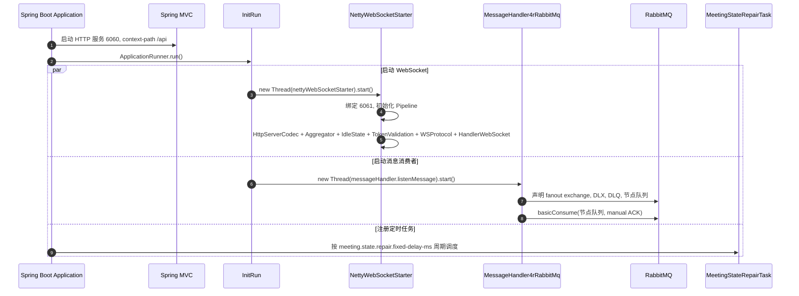
```mermaid
sequenceDiagram
    autonumber
    participant JVM as Spring Boot Application
    participant MVC as Spring MVC
    participant Init as InitRun
    participant Netty as NettyWebSocketStarter
    participant MQ as MessageHandler4rRabbitMq
    participant Rabbit as RabbitMQ
    participant Task as MeetingStateRepairTask

    JVM->>MVC: 启动 HTTP 服务 6060, context-path /api
    JVM->>Init: ApplicationRunner.run()
    par 启动 WebSocket
        Init->>Netty: new Thread(nettyWebSocketStarter).start()
        Netty->>Netty: 绑定 6061, 初始化 Pipeline
        Netty->>Netty: HttpServerCodec + Aggregator + IdleState + TokenValidation + WSProtocol + HandlerWebSocket
    and 启动消息消费者
        Init->>MQ: new Thread(messageHandler.listenMessage).start()
        MQ->>Rabbit: 声明 fanout exchange, DLX, DLQ, 节点队列
        MQ->>Rabbit: basicConsume(节点队列, manual ACK)
    and 注册定时任务
        JVM->>Task: 按 meeting.state.repair.fixed-delay-ms 周期调度
    end
```

## 2. HTTP 统一鉴权与异常返回

所有带 `@GlobalInterceptor` 的接口都会先进入 AOP。`checkLogin=false` 的更新接口会跳过登录校验；`checkAdmin=true` 会额外检查管理员标识。

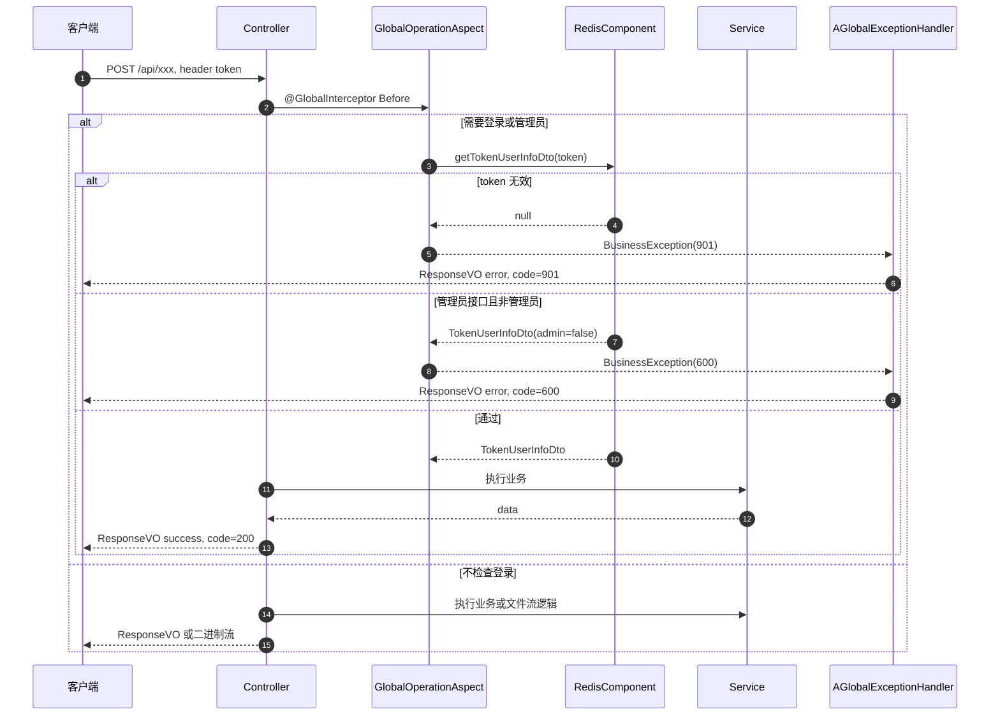
```mermaid
sequenceDiagram
    autonumber
    participant C as 客户端
    participant Ctrl as Controller
    participant AOP as GlobalOperationAspect
    participant Redis as RedisComponent
    participant Svc as Service
    participant Ex as AGlobalExceptionHandler

    C->>Ctrl: POST /api/xxx, header token
    Ctrl->>AOP: @GlobalInterceptor Before
    alt 需要登录或管理员
        AOP->>Redis: getTokenUserInfoDto(token)
        alt token 无效
            Redis-->>AOP: null
            AOP-->>Ex: BusinessException(901)
            Ex-->>C: ResponseVO error, code=901
        else 管理员接口且非管理员
            Redis-->>AOP: TokenUserInfoDto(admin=false)
            AOP-->>Ex: BusinessException(600)
            Ex-->>C: ResponseVO error, code=600
        else 通过
            Redis-->>AOP: TokenUserInfoDto
            Ctrl->>Svc: 执行业务
            Svc-->>Ctrl: data
            Ctrl-->>C: ResponseVO success, code=200
        end
    else 不检查登录
        Ctrl->>Svc: 执行业务或文件流逻辑
        Ctrl-->>C: ResponseVO 或二进制流
    end
```

## 3. 前端登录态、请求封装与 901 处理

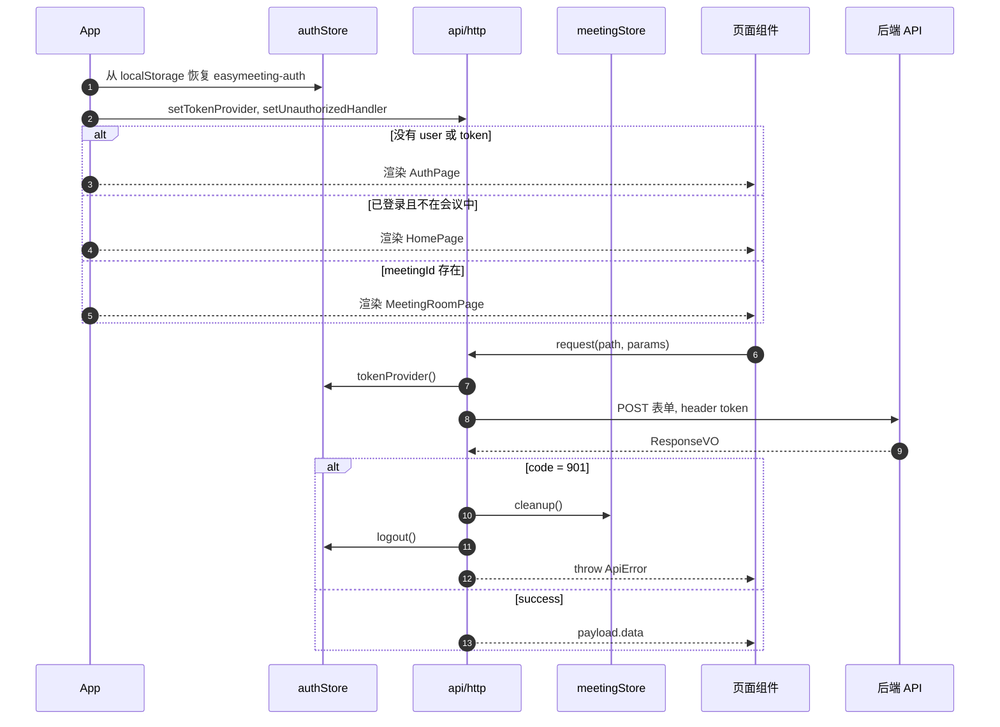
```mermaid
sequenceDiagram
    autonumber
    participant App as App
    participant AuthStore as authStore
    participant Http as api/http
    participant MeetingStore as meetingStore
    participant Page as 页面组件
    participant API as 后端 API

    App->>AuthStore: 从 localStorage 恢复 easymeeting-auth
    App->>Http: setTokenProvider, setUnauthorizedHandler
    alt 没有 user 或 token
        App-->>Page: 渲染 AuthPage
    else 已登录且不在会议中
        App-->>Page: 渲染 HomePage
    else meetingId 存在
        App-->>Page: 渲染 MeetingRoomPage
    end

    Page->>Http: request(path, params)
    Http->>AuthStore: tokenProvider()
    Http->>API: POST 表单, header token
    API-->>Http: ResponseVO
    alt code = 901
        Http->>MeetingStore: cleanup()
        Http->>AuthStore: logout()
        Http-->>Page: throw ApiError
    else success
        Http-->>Page: payload.data
    end
```

## 4. 账号验证码、注册、登录

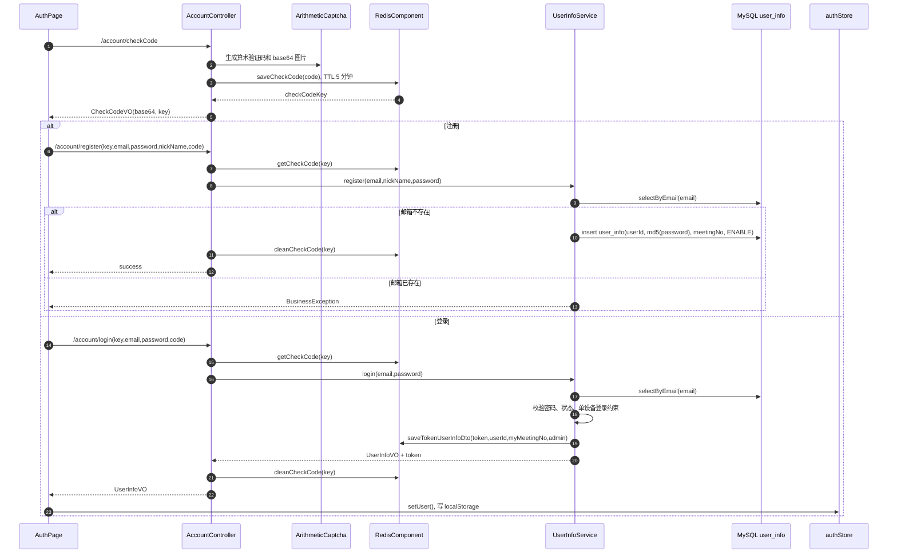
```mermaid
sequenceDiagram
    autonumber
    participant FE as AuthPage
    participant API as AccountController
    participant Captcha as ArithmeticCaptcha
    participant Redis as RedisComponent
    participant UserSvc as UserInfoService
    participant DB as MySQL user_info
    participant Store as authStore

    FE->>API: /account/checkCode
    API->>Captcha: 生成算术验证码和 base64 图片
    API->>Redis: saveCheckCode(code), TTL 5 分钟
    Redis-->>API: checkCodeKey
    API-->>FE: CheckCodeVO(base64, key)

    alt 注册
        FE->>API: /account/register(key,email,password,nickName,code)
        API->>Redis: getCheckCode(key)
        API->>UserSvc: register(email,nickName,password)
        UserSvc->>DB: selectByEmail(email)
        alt 邮箱不存在
            UserSvc->>DB: insert user_info(userId, md5(password), meetingNo, ENABLE)
            API->>Redis: cleanCheckCode(key)
            API-->>FE: success
        else 邮箱已存在
            UserSvc-->>FE: BusinessException
        end
    else 登录
        FE->>API: /account/login(key,email,password,code)
        API->>Redis: getCheckCode(key)
        API->>UserSvc: login(email,password)
        UserSvc->>DB: selectByEmail(email)
        UserSvc->>UserSvc: 校验密码、状态、单设备登录约束
        UserSvc->>Redis: saveTokenUserInfoDto(token,userId,myMeetingNo,admin)
        UserSvc-->>API: UserInfoVO + token
        API->>Redis: cleanCheckCode(key)
        API-->>FE: UserInfoVO
        FE->>Store: setUser(), 写 localStorage
    end
```

## 5. 快速创建会议并进入会议室

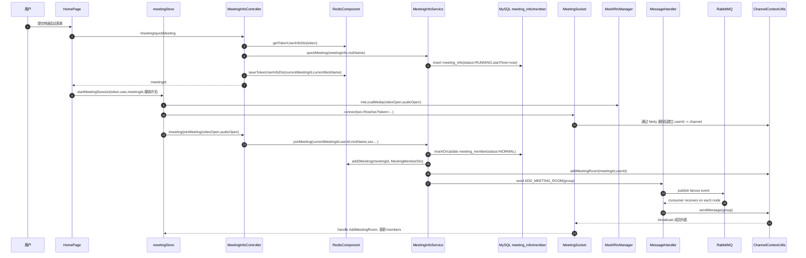
```mermaid
sequenceDiagram
    autonumber
    participant U as 用户
    participant Home as HomePage
    participant Store as meetingStore
    participant API as MeetingInfoController
    participant Redis as RedisComponent
    participant Svc as MeetingInfoService
    participant DB as MySQL meeting_info/member
    participant WS as MeetingSocket
    participant RTC as MeshRtcManager
    participant Msg as MessageHandler
    participant Bus as RabbitMQ
    participant Channel as ChannelContextUtils

    U->>Home: 提交快速会议表单
    Home->>API: /meeting/quickMeeting
    API->>Redis: getTokenUserInfoDto(token)
    API->>Svc: quickMeeting(meetingInfo,nickName)
    Svc->>DB: insert meeting_info(status=RUNNING,startTime=now)
    API->>Redis: saveTokenUserInfoDto(currentMeetingId,currentNickName)
    API-->>Home: meetingId

    Home->>Store: startMeetingSession(token,user,meetingId,媒体开关)
    Store->>RTC: initLocalMedia(videoOpen,audioOpen)
    Store->>WS: connect(ws://host/ws?token=...)
    WS->>Channel: 通过 Netty 鉴权后建立 userId -> channel
    Store->>API: /meeting/joinMeeting(videoOpen,audioOpen)
    API->>Svc: joinMeeting(currentMeetingId,userId,nickName,sex,...)
    Svc->>DB: insertOrUpdate meeting_member(status=NORMAL)
    Svc->>Redis: add2Meeting(meetingId, MeetingMemberDto)
    Svc->>Channel: addMeetingRoom(meetingId,userId)
    Svc->>Msg: send ADD_MEETING_ROOM(group)
    Msg->>Bus: publish fanout event
    Bus-->>Msg: consumer receives on each node
    Msg->>Channel: sendMessage(group)
    Channel-->>WS: broadcast 成员列表
    WS-->>Store: handle AddMeetingRoom, 更新 members
```

## 6. 加入已有或预约会议

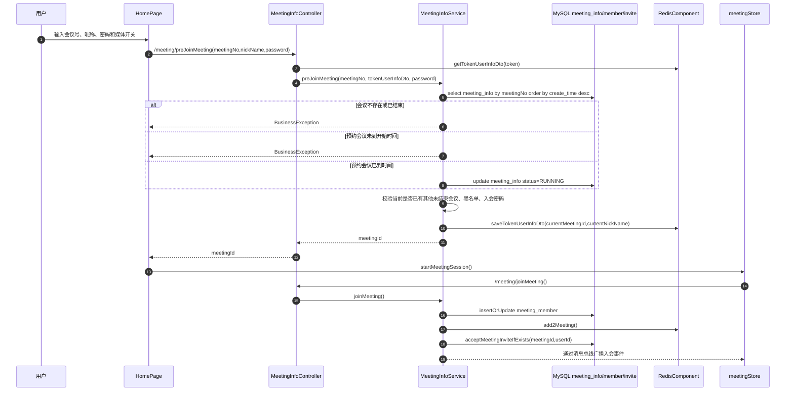
```mermaid
sequenceDiagram
    autonumber
    participant U as 用户
    participant Home as HomePage
    participant API as MeetingInfoController
    participant Svc as MeetingInfoService
    participant DB as MySQL meeting_info/member/invite
    participant Redis as RedisComponent
    participant Store as meetingStore

    U->>Home: 输入会议号、昵称、密码和媒体开关
    Home->>API: /meeting/preJoinMeeting(meetingNo,nickName,password)
    API->>Redis: getTokenUserInfoDto(token)
    API->>Svc: preJoinMeeting(meetingNo, tokenUserInfoDto, password)
    Svc->>DB: select meeting_info by meetingNo order by create_time desc
    alt 会议不存在或已结束
        Svc-->>Home: BusinessException
    else 预约会议未到开始时间
        Svc-->>Home: BusinessException
    else 预约会议已到时间
        Svc->>DB: update meeting_info status=RUNNING
    end
    Svc->>Svc: 校验当前是否已有其他未结束会议、黑名单、入会密码
    Svc->>Redis: saveTokenUserInfoDto(currentMeetingId,currentNickName)
    Svc-->>API: meetingId
    API-->>Home: meetingId
    Home->>Store: startMeetingSession()
    Store->>API: /meeting/joinMeeting()
    API->>Svc: joinMeeting()
    Svc->>DB: insertOrUpdate meeting_member
    Svc->>Redis: add2Meeting()
    Svc->>DB: acceptMeetingInviteIfExists(meetingId,userId)
    Svc-->>Store: 通过消息总线广播入会事件
```

## 7. 预约会议、今日会议、取消预约

`MeetingReserveController` 同时声明了 `@RequestMapping({ "/meetingReserve", "/userContact" })`，所以下面三个流程分别有 `/meetingReserve/...` 和 `/userContact/...` 两组等价入口。

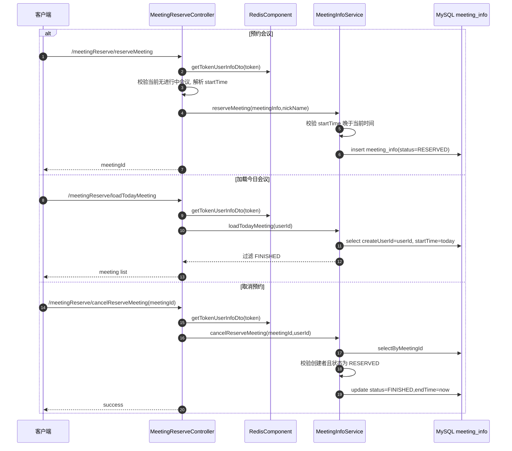
```mermaid
sequenceDiagram
    autonumber
    participant C as 客户端
    participant Ctrl as MeetingReserveController
    participant Redis as RedisComponent
    participant Svc as MeetingInfoService
    participant DB as MySQL meeting_info

    alt 预约会议
        C->>Ctrl: /meetingReserve/reserveMeeting
        Ctrl->>Redis: getTokenUserInfoDto(token)
        Ctrl->>Ctrl: 校验当前无进行中会议, 解析 startTime
        Ctrl->>Svc: reserveMeeting(meetingInfo,nickName)
        Svc->>Svc: 校验 startTime 晚于当前时间
        Svc->>DB: insert meeting_info(status=RESERVED)
        Ctrl-->>C: meetingId
    else 加载今日会议
        C->>Ctrl: /meetingReserve/loadTodayMeeting
        Ctrl->>Redis: getTokenUserInfoDto(token)
        Ctrl->>Svc: loadTodayMeeting(userId)
        Svc->>DB: select createUserId=userId, startTime=today
        Svc-->>Ctrl: 过滤 FINISHED
        Ctrl-->>C: meeting list
    else 取消预约
        C->>Ctrl: /meetingReserve/cancelReserveMeeting(meetingId)
        Ctrl->>Redis: getTokenUserInfoDto(token)
        Ctrl->>Svc: cancelReserveMeeting(meetingId,userId)
        Svc->>DB: selectByMeetingId
        Svc->>Svc: 校验创建者且状态为 RESERVED
        Svc->>DB: update status=FINISHED,endTime=now
        Ctrl-->>C: success
    end
```

## 8. WebSocket 建链、心跳、断线自动退会

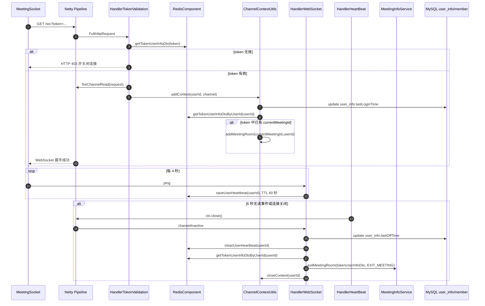
```mermaid
sequenceDiagram
    autonumber
    participant FE as MeetingSocket
    participant Netty as Netty Pipeline
    participant Token as HandlerTokenValidation
    participant Redis as RedisComponent
    participant Channel as ChannelContextUtils
    participant WSH as HandlerWebSocket
    participant HB as HandlerHeartBeat
    participant Svc as MeetingInfoService
    participant DB as MySQL user_info/member

    FE->>Netty: GET /ws?token=...
    Netty->>Token: FullHttpRequest
    Token->>Redis: getTokenUserInfoDto(token)
    alt token 无效
        Token-->>FE: HTTP 403 并关闭连接
    else token 有效
        Token->>Netty: fireChannelRead(request)
        Token->>Channel: addContext(userId, channel)
        Channel->>DB: update user_info.lastLoginTime
        Channel->>Redis: getTokenUserInfoDtoByUserId(userId)
        alt token 中已有 currentMeetingId
            Channel->>Channel: addMeetingRoom(currentMeetingId,userId)
        end
        Netty-->>FE: WebSocket 握手成功
    end

    loop 每 4 秒
        FE->>WSH: ping
        WSH->>Redis: saveUserHeartbeat(userId), TTL 60 秒
    end

    alt 6 秒无读事件或连接关闭
        HB->>Netty: ctx.close()
        Netty->>WSH: channelInactive
        WSH->>DB: update user_info.lastOffTime
        WSH->>Redis: cleanUserHeartbeat(userId)
        WSH->>Redis: getTokenUserInfoDtoByUserId(userId)
        WSH->>Svc: exitMeetingRoom(tokenUserInfoDto, EXIT_MEETING)
        WSH->>Channel: closeContext(userId)
    end
```

## 9. WebRTC 信令转发

前端使用 2-4 人 Mesh。媒体流点对点传输，服务端只转发 offer、answer、candidate 等信令。

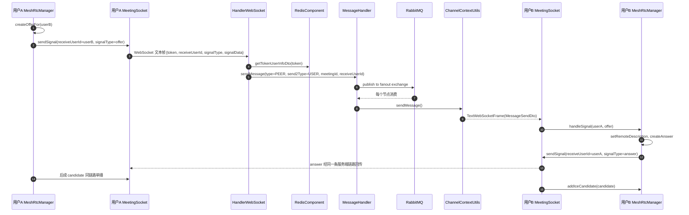
```mermaid
sequenceDiagram
    autonumber
    participant A as 用户A MeshRtcManager
    participant AWS as 用户A MeetingSocket
    participant WSH as HandlerWebSocket
    participant Redis as RedisComponent
    participant Msg as MessageHandler
    participant MQ as RabbitMQ
    participant Channel as ChannelContextUtils
    participant BWS as 用户B MeetingSocket
    participant B as 用户B MeshRtcManager

    A->>A: createOfferFor(userB)
    A->>AWS: sendSignal(receiveUserId=userB, signalType=offer)
    AWS->>WSH: WebSocket 文本帧 {token, receiveUserId, signalType, signalData}
    WSH->>Redis: getTokenUserInfoDto(token)
    WSH->>Msg: sendMessage(type=PEER, send2Type=USER, meetingId, receiveUserId)
    Msg->>MQ: publish to fanout exchange
    MQ-->>Msg: 每个节点消费
    Msg->>Channel: sendMessage()
    Channel-->>BWS: TextWebSocketFrame(MessageSendDto)
    BWS->>B: handleSignal(userA, offer)
    B->>B: setRemoteDescription, createAnswer
    B->>BWS: sendSignal(receiveUserId=userA, signalType=answer)
    BWS-->>AWS: answer 经同一条服务端链路回传
    A->>AWS: 后续 candidate 同链路单播
    BWS->>B: addIceCandidate(candidate)
```

## 10. RabbitMQ 会议事件总线、去重、重试、死信

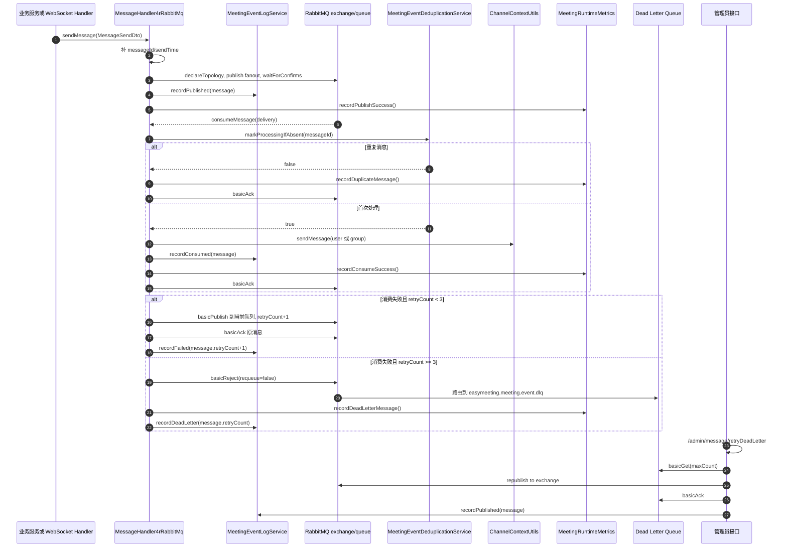
```mermaid
sequenceDiagram
    autonumber
    participant Sender as 业务服务或 WebSocket Handler
    participant Msg as MessageHandler4rRabbitMq
    participant Log as MeetingEventLogService
    participant MQ as RabbitMQ exchange/queue
    participant Dedup as MeetingEventDeduplicationService
    participant Channel as ChannelContextUtils
    participant Metrics as MeetingRuntimeMetrics
    participant DLQ as Dead Letter Queue
    participant Admin as 管理员接口

    Sender->>Msg: sendMessage(MessageSendDto)
    Msg->>Msg: 补 messageId/sendTime
    Msg->>MQ: declareTopology, publish fanout, waitForConfirms
    Msg->>Log: recordPublished(message)
    Msg->>Metrics: recordPublishSuccess()

    MQ-->>Msg: consumeMessage(delivery)
    Msg->>Dedup: markProcessingIfAbsent(messageId)
    alt 重复消息
        Dedup-->>Msg: false
        Msg->>Metrics: recordDuplicateMessage()
        Msg->>MQ: basicAck
    else 首次处理
        Dedup-->>Msg: true
        Msg->>Channel: sendMessage(user 或 group)
        Msg->>Log: recordConsumed(message)
        Msg->>Metrics: recordConsumeSuccess()
        Msg->>MQ: basicAck
    end

    alt 消费失败且 retryCount < 3
        Msg->>MQ: basicPublish 到当前队列, retryCount+1
        Msg->>MQ: basicAck 原消息
        Msg->>Log: recordFailed(message,retryCount+1)
    else 消费失败且 retryCount >= 3
        Msg->>MQ: basicReject(requeue=false)
        MQ->>DLQ: 路由到 easymeeting.meeting.event.dlq
        Msg->>Metrics: recordDeadLetterMessage()
        Msg->>Log: recordDeadLetter(message,retryCount)
    end

    Admin->>Admin: /admin/message/retryDeadLetter
    Admin->>DLQ: basicGet(maxCount)
    Admin->>MQ: republish to exchange
    Admin->>DLQ: basicAck
    Admin->>Log: recordPublished(message)
```

## 11. 媒体开关状态同步

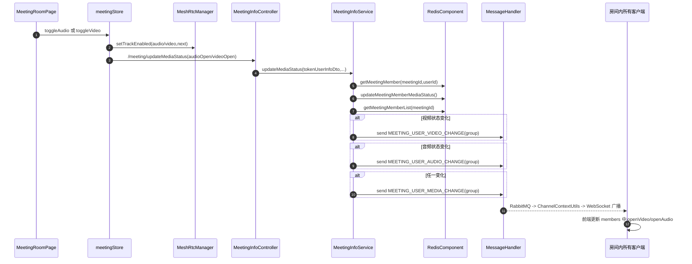
```mermaid
sequenceDiagram
    autonumber
    participant UI as MeetingRoomPage
    participant Store as meetingStore
    participant RTC as MeshRtcManager
    participant API as MeetingInfoController
    participant Svc as MeetingInfoService
    participant Redis as RedisComponent
    participant Msg as MessageHandler
    participant Room as 房间内所有客户端

    UI->>Store: toggleAudio 或 toggleVideo
    Store->>RTC: setTrackEnabled(audio/video,next)
    Store->>API: /meeting/updateMediaStatus(audioOpen/videoOpen)
    API->>Svc: updateMediaStatus(tokenUserInfoDto,...)
    Svc->>Redis: getMeetingMember(meetingId,userId)
    Svc->>Redis: updateMeetingMemberMediaStatus()
    Svc->>Redis: getMeetingMemberList(meetingId)
    alt 视频状态变化
        Svc->>Msg: send MEETING_USER_VIDEO_CHANGE(group)
    end
    alt 音频状态变化
        Svc->>Msg: send MEETING_USER_AUDIO_CHANGE(group)
    end
    alt 任一变化
        Svc->>Msg: send MEETING_USER_MEDIA_CHANGE(group)
    end
    Msg-->>Room: RabbitMQ -> ChannelContextUtils -> WebSocket 广播
    Room->>Room: 前端更新 members 中 openVideo/openAudio
```

## 12. 退会、踢人、拉黑、结束会议

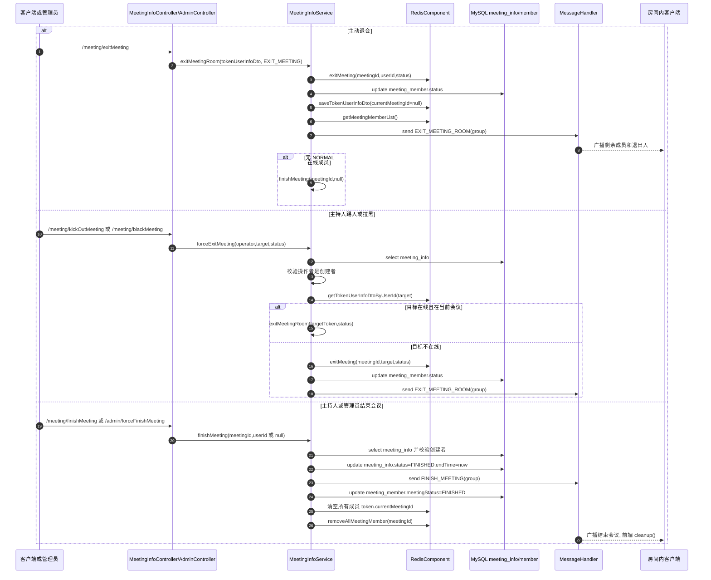
```mermaid
sequenceDiagram
    autonumber
    participant C as 客户端或管理员
    participant Ctrl as MeetingInfoController/AdminController
    participant Svc as MeetingInfoService
    participant Redis as RedisComponent
    participant DB as MySQL meeting_info/member
    participant Msg as MessageHandler
    participant Room as 房间内客户端

    alt 主动退会
        C->>Ctrl: /meeting/exitMeeting
        Ctrl->>Svc: exitMeetingRoom(tokenUserInfoDto, EXIT_MEETING)
        Svc->>Redis: exitMeeting(meetingId,userId,status)
        Svc->>DB: update meeting_member.status
        Svc->>Redis: saveTokenUserInfoDto(currentMeetingId=null)
        Svc->>Redis: getMeetingMemberList()
        Svc->>Msg: send EXIT_MEETING_ROOM(group)
        Msg-->>Room: 广播剩余成员和退出人
        alt 无 NORMAL 在线成员
            Svc->>Svc: finishMeeting(meetingId,null)
        end
    else 主持人踢人或拉黑
        C->>Ctrl: /meeting/kickOutMeeting 或 /meeting/blackMeeting
        Ctrl->>Svc: forceExitMeeting(operator,target,status)
        Svc->>DB: select meeting_info
        Svc->>Svc: 校验操作者是创建者
        Svc->>Redis: getTokenUserInfoDtoByUserId(target)
        alt 目标在线且在当前会议
            Svc->>Svc: exitMeetingRoom(targetToken,status)
        else 目标不在线
            Svc->>Redis: exitMeeting(meetingId,target,status)
            Svc->>DB: update meeting_member.status
            Svc->>Msg: send EXIT_MEETING_ROOM(group)
        end
    else 主持人或管理员结束会议
        C->>Ctrl: /meeting/finishMeeting 或 /admin/forceFinishMeeting
        Ctrl->>Svc: finishMeeting(meetingId,userId 或 null)
        Svc->>DB: select meeting_info 并校验创建者
        Svc->>DB: update meeting_info.status=FINISHED,endTime=now
        Svc->>Msg: send FINISH_MEETING(group)
        Svc->>DB: update meeting_member.meetingStatus=FINISHED
        Svc->>Redis: 清空所有成员 token.currentMeetingId
        Svc->>Redis: removeAllMeetingMember(meetingId)
        Msg-->>Room: 广播结束会议, 前端 cleanup()
    end
```

## 13. 会议邀请状态机

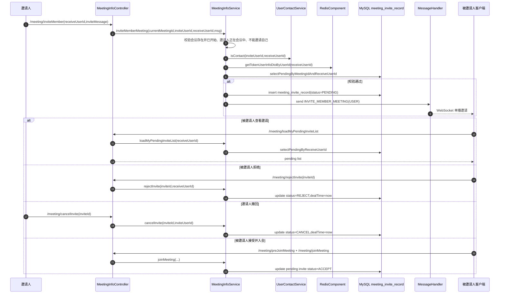
```mermaid
sequenceDiagram
    autonumber
    participant Inviter as 邀请人
    participant API as MeetingInfoController
    participant Svc as MeetingInfoService
    participant Contact as UserContactService
    participant Redis as RedisComponent
    participant DB as MySQL meeting_invite_record
    participant Msg as MessageHandler
    participant Receiver as 被邀请人客户端

    Inviter->>API: /meeting/inviteMember(receiveUserId,inviteMessage)
    API->>Svc: inviteMemberMeeting(currentMeetingId,inviteUserId,receiveUserId,msg)
    Svc->>Svc: 校验会议存在并已开始、邀请人正在会议中、不能邀请自己
    Svc->>Contact: isContact(inviteUserId,receiveUserId)
    Svc->>Redis: getTokenUserInfoDtoByUserId(receiveUserId)
    Svc->>DB: selectPendingByMeetingIdAndReceiveUserId
    alt 校验通过
        Svc->>DB: insert meeting_invite_record(status=PENDING)
        Svc->>Msg: send INVITE_MEMBER_MEETING(USER)
        Msg-->>Receiver: WebSocket 单播邀请
    end

    alt 被邀请人查看邀请
        Receiver->>API: /meeting/loadMyPendingInviteList
        API->>Svc: loadMyPendingInviteList(receiveUserId)
        Svc->>DB: selectPendingByReceiveUserId
        API-->>Receiver: pending list
    else 被邀请人拒绝
        Receiver->>API: /meeting/rejectInvite(inviteId)
        API->>Svc: rejectInvite(inviteId,receiveUserId)
        Svc->>DB: update status=REJECT,dealTime=now
    else 邀请人撤回
        Inviter->>API: /meeting/cancelInvite(inviteId)
        API->>Svc: cancelInvite(inviteId,inviteUserId)
        Svc->>DB: update status=CANCEL,dealTime=now
    else 被邀请人接受并入会
        Receiver->>API: /meeting/preJoinMeeting + /meeting/joinMeeting
        API->>Svc: joinMeeting(...)
        Svc->>DB: update pending invite status=ACCEPT
    end
```

## 14. 联系人申请、处理、查询

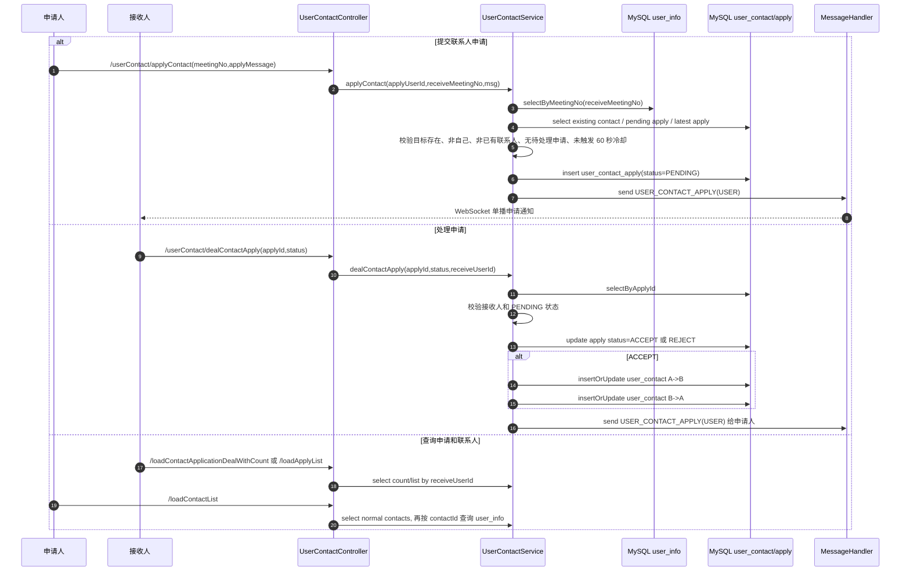
```mermaid
sequenceDiagram
    autonumber
    participant A as 申请人
    participant B as 接收人
    participant Ctrl as UserContactController
    participant Svc as UserContactService
    participant UserDB as MySQL user_info
    participant ContactDB as MySQL user_contact/apply
    participant Msg as MessageHandler

    alt 提交联系人申请
        A->>Ctrl: /userContact/applyContact(meetingNo,applyMessage)
        Ctrl->>Svc: applyContact(applyUserId,receiveMeetingNo,msg)
        Svc->>UserDB: selectByMeetingNo(receiveMeetingNo)
        Svc->>ContactDB: select existing contact / pending apply / latest apply
        Svc->>Svc: 校验目标存在、非自己、非已有联系人、无待处理申请、未触发 60 秒冷却
        Svc->>ContactDB: insert user_contact_apply(status=PENDING)
        Svc->>Msg: send USER_CONTACT_APPLY(USER)
        Msg-->>B: WebSocket 单播申请通知
    else 处理申请
        B->>Ctrl: /userContact/dealContactApply(applyId,status)
        Ctrl->>Svc: dealContactApply(applyId,status,receiveUserId)
        Svc->>ContactDB: selectByApplyId
        Svc->>Svc: 校验接收人和 PENDING 状态
        Svc->>ContactDB: update apply status=ACCEPT 或 REJECT
        alt ACCEPT
            Svc->>ContactDB: insertOrUpdate user_contact A->B
            Svc->>ContactDB: insertOrUpdate user_contact B->A
        end
        Svc->>Msg: send USER_CONTACT_APPLY(USER) 给申请人
    else 查询申请和联系人
        B->>Ctrl: /loadContactApplicationDealWithCount 或 /loadApplyList
        Ctrl->>Svc: select count/list by receiveUserId
        A->>Ctrl: /loadContactList
        Ctrl->>Svc: select normal contacts, 再按 contactId 查询 user_info
    end
```

## 15. 文件上传和下载

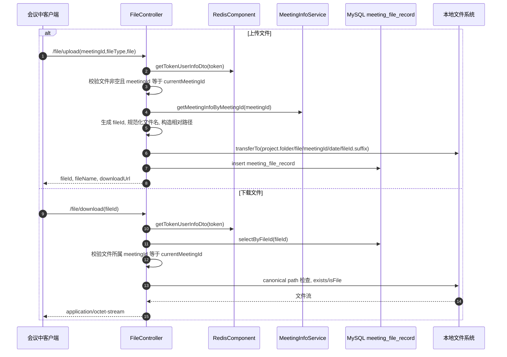
```mermaid
sequenceDiagram
    autonumber
    participant C as 会议中客户端
    participant Ctrl as FileController
    participant Redis as RedisComponent
    participant Svc as MeetingInfoService
    participant DB as MySQL meeting_file_record
    participant FS as 本地文件系统

    alt 上传文件
        C->>Ctrl: /file/upload(meetingId,fileType,file)
        Ctrl->>Redis: getTokenUserInfoDto(token)
        Ctrl->>Ctrl: 校验文件非空且 meetingId 等于 currentMeetingId
        Ctrl->>Svc: getMeetingInfoByMeetingId(meetingId)
        Ctrl->>Ctrl: 生成 fileId, 规范化文件名, 构造相对路径
        Ctrl->>FS: transferTo(project.folder/file/meetingId/date/fileId.suffix)
        Ctrl->>DB: insert meeting_file_record
        Ctrl-->>C: fileId, fileName, downloadUrl
    else 下载文件
        C->>Ctrl: /file/download(fileId)
        Ctrl->>Redis: getTokenUserInfoDto(token)
        Ctrl->>DB: selectByFileId(fileId)
        Ctrl->>Ctrl: 校验文件所属 meetingId 等于 currentMeetingId
        Ctrl->>FS: canonical path 检查, exists/isFile
        FS-->>Ctrl: 文件流
        Ctrl-->>C: application/octet-stream
    end
```

## 16. 查询类接口、后台管理、运维接口

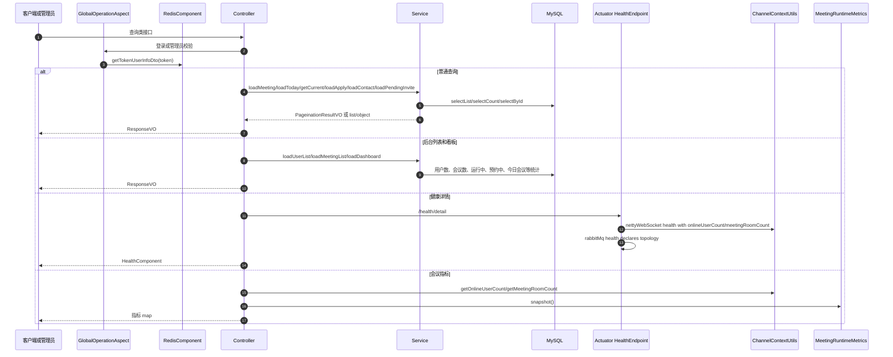
```mermaid
sequenceDiagram
    autonumber
    participant C as 客户端或管理员
    participant AOP as GlobalOperationAspect
    participant Redis as RedisComponent
    participant Ctrl as Controller
    participant Svc as Service
    participant DB as MySQL
    participant Health as Actuator HealthEndpoint
    participant Channel as ChannelContextUtils
    participant Metrics as MeetingRuntimeMetrics

    C->>Ctrl: 查询类接口
    Ctrl->>AOP: 登录或管理员校验
    AOP->>Redis: getTokenUserInfoDto(token)
    alt 普通查询
        Ctrl->>Svc: loadMeeting/loadToday/getCurrent/loadApply/loadContact/loadPendingInvite
        Svc->>DB: selectList/selectCount/selectById
        Svc-->>Ctrl: PageinationResultVO 或 list/object
        Ctrl-->>C: ResponseVO
    else 后台列表和看板
        Ctrl->>Svc: loadUserList/loadMeetingList/loadDashboard
        Svc->>DB: 用户数、会议数、运行中、预约中、今日会议等统计
        Ctrl-->>C: ResponseVO
    else 健康详情
        Ctrl->>Health: /health/detail
        Health->>Channel: nettyWebSocket health with onlineUserCount/meetingRoomCount
        Health->>Health: rabbitMq health declares topology
        Ctrl-->>C: HealthComponent
    else 会议指标
        Ctrl->>Channel: getOnlineUserCount/getMeetingRoomCount
        Ctrl->>Metrics: snapshot()
        Ctrl-->>C: 指标 map
    end
```

覆盖的查询入口包括：`/meeting/loadMeeting`、`/meeting/getCurrentMeeting`、`/meetingReserve/loadTodayMeeting`、`/meeting/loadMyPendingInviteList`、`/userContact/loadContactApplicationDealWithCount`、`/userContact/loadApplyList`、`/userContact/loadContactList`、`/admin/loadUserList`、`/admin/loadMeetingList`、`/admin/loadDashboard`、`/health/detail`、`/admin/metrics/meeting`。

## 17. 客户端版本检查和安装包下载

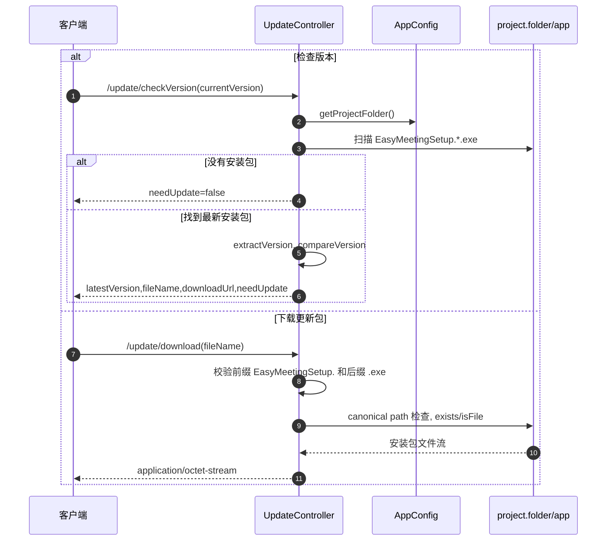
```mermaid
sequenceDiagram
    autonumber
    participant C as 客户端
    participant Ctrl as UpdateController
    participant Config as AppConfig
    participant FS as project.folder/app

    alt 检查版本
        C->>Ctrl: /update/checkVersion(currentVersion)
        Ctrl->>Config: getProjectFolder()
        Ctrl->>FS: 扫描 EasyMeetingSetup.*.exe
        alt 没有安装包
            Ctrl-->>C: needUpdate=false
        else 找到最新安装包
            Ctrl->>Ctrl: extractVersion, compareVersion
            Ctrl-->>C: latestVersion,fileName,downloadUrl,needUpdate
        end
    else 下载更新包
        C->>Ctrl: /update/download(fileName)
        Ctrl->>Ctrl: 校验前缀 EasyMeetingSetup. 和后缀 .exe
        Ctrl->>FS: canonical path 检查, exists/isFile
        FS-->>Ctrl: 安装包文件流
        Ctrl-->>C: application/octet-stream
    end
```

## 18. 会议状态定时修复

该任务处理“DB 里仍是会议中，但 Redis 房间成员已不在线”的残留状态。它只修复持久状态和 token，不广播 WebSocket 事件。

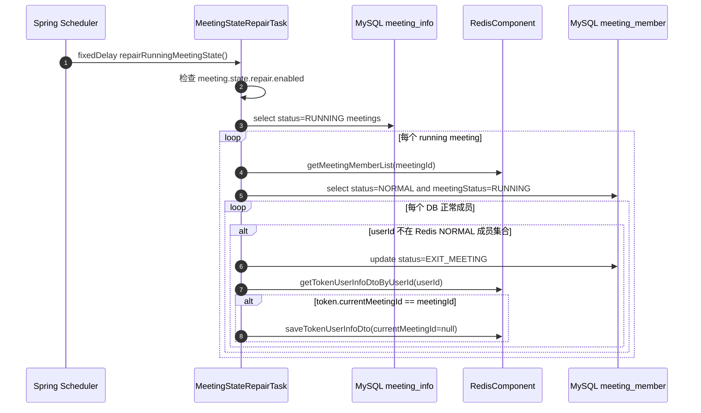
```mermaid
sequenceDiagram
    autonumber
    participant Scheduler as Spring Scheduler
    participant Task as MeetingStateRepairTask
    participant MeetingDB as MySQL meeting_info
    participant Redis as RedisComponent
    participant MemberDB as MySQL meeting_member

    Scheduler->>Task: fixedDelay repairRunningMeetingState()
    Task->>Task: 检查 meeting.state.repair.enabled
    Task->>MeetingDB: select status=RUNNING meetings
    loop 每个 running meeting
        Task->>Redis: getMeetingMemberList(meetingId)
        Task->>MemberDB: select status=NORMAL and meetingStatus=RUNNING
        loop 每个 DB 正常成员
            alt userId 不在 Redis NORMAL 成员集合
                Task->>MemberDB: update status=EXIT_MEETING
                Task->>Redis: getTokenUserInfoDtoByUserId(userId)
                alt token.currentMeetingId == meetingId
                    Task->>Redis: saveTokenUserInfoDto(currentMeetingId=null)
                end
            end
        end
    end
```

## 19. 聊天消息分表能力

当前仓库有 `MeetingChatMessageServiceImpl` 和 `MeetingChatMessageMapper.xml`，会按 `meetingId` 通过 `TableSplitUtils` 路由到动态表名；但当前前端、Controller 和 WebSocket 主流程没有调用它，所以它是已准备但未接入的能力。

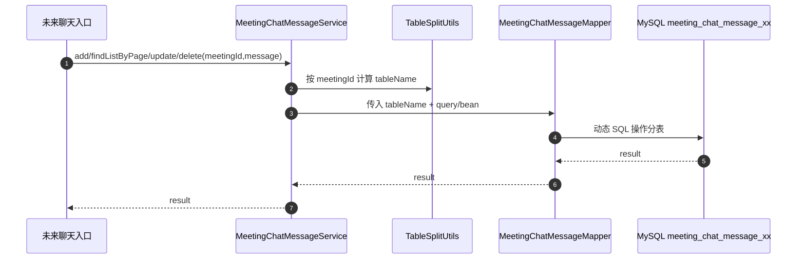
```mermaid
sequenceDiagram
    autonumber
    participant Future as 未来聊天入口
    participant ChatSvc as MeetingChatMessageService
    participant Split as TableSplitUtils
    participant Mapper as MeetingChatMessageMapper
    participant DB as MySQL meeting_chat_message_xx

    Future->>ChatSvc: add/findListByPage/update/delete(meetingId,message)
    ChatSvc->>Split: 按 meetingId 计算 tableName
    ChatSvc->>Mapper: 传入 tableName + query/bean
    Mapper->>DB: 动态 SQL 操作分表
    DB-->>Mapper: result
    Mapper-->>ChatSvc: result
    ChatSvc-->>Future: result
```
