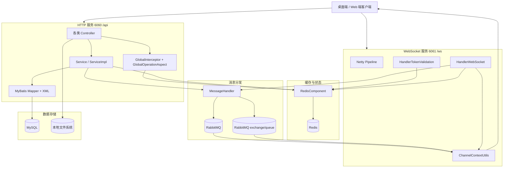

# EasyMeeting 后端代码精讲与面试指南

> 适用对象：准备 Java 后端岗位面试、需要把当前仓库讲透的求职者  
> 使用原则：本文只写当前仓库能证明的技术事实，不编造团队规模、用户量、上线收益、项目周期等信息  
> 阅读顺序：先把“代码讲解”吃透，再看“面试题与 PREP 作答模板”

---

## 1. 先给项目一个准确定位

### 1.1 一句话定义

EasyMeeting 是一个以 **Spring Boot 单体应用** 为核心的会议系统后端，既提供传统 HTTP 业务接口，也承担 WebSocket 信令转发、会议房间状态管理、文件上传下载、客户端更新包分发，以及 RabbitMQ 消息分发能力。

### 1.2 用三句话概括项目核心价值

1. 它把“账号体系、联系人体系、会议生命周期、实时通信辅助能力”放在同一个后端里，业务闭环比较完整。  
2. 它不是纯 CRUD 项目，因为除了数据库增删改查，还涉及 **Redis 状态缓存、Netty WebSocket、消息分发、文件系统、版本更新**。  
3. 它很适合拿来面试，因为能同时讲清楚 **Web 接口、状态一致性、实时通信、权限校验、SQL 与分表设计**。

### 1.3 从仓库能证明什么，不能证明什么

| 维度 | 当前仓库能证明 | 当前仓库不能证明 |
| --- | --- | --- |
| 业务能力 | 账号登录、会议创建/预约、入会退会、联系人申请、邀请入会、文件上传下载、后台管理、版本检查、WebSocket 信令 | 真实企业客户是谁、是否商用、是否上线到生产 |
| 技术深度 | Spring Boot、MyBatis、Redis、Netty、RabbitMQson、文件流下载、分表设计 | 实际并发量、压测数据、监控告警体系、容器化部署 |
| 项目完整度 | 后端接口和实时模块较完整，配置齐全，SQL 补丁也有 | 前端代码不在当前仓库，无法直接证明完整端到端交互页面 |
| 工程质量 | 有统一返回体、统一异常处理、AOP 登录拦截、枚举与常量抽象 | 单元测试、集成测试、CI/CD 流程、真实运维规范 |

### 1.4 面试时如何定义“这是不是一个真实项目”

最稳妥的说法是：

- 从代码结构看，它不是教学 Demo 级别的单表增删改查，而是一个有明确业务边界的会议系统后端。
- 从仓库事实看，它具备真实项目常见的技术元素：登录态、权限拦截、会议状态机、WebSocket、Redis、消息通道、文件落盘、更新包下载。
- 但“是否真实生产项目、服务过多少用户、上线后效果如何”，**代码本身无法证明**，这部分只能由你结合自己的实际经历补充，不能硬编。

### 1.5 仓库级事实快照

- HTTP 服务端口：`6060`
- HTTP 上下文路径：`/api`
- WebSocket 端口：`6061`
- WebSocket 握手路径：`/ws`
- 文件上传限制：`15MB`
- 数据库：MySQL，驱动 `8.0.30`
- Redis：本地 `6379`
- 默认消息分发通道：`rabbitmq`
- 方法级 HTTP 接口：`33` 个
- Controller：`9` 个
- Service 实现：`5` 个
- Mapper XML：`8` 个
- 测试目录：当前仓库 **没有**

---

## 2. 技术栈与选型理由

### 2.1 技术栈总表

| 层次 | 技术 | 仓库事实 | 在本项目中的职责 |
| --- | --- | --- | --- |
| 语言与运行时 | Java 8 | `java.version=1.8` | 服务端主语言 |
| Web 框架 | Spring Boot 2.7.x | 父 POM `2.7.16`，部分 starter 指到 `2.7.18` | 负责 IOC、MVC、配置加载、异常处理 |
| 参数校验 | Spring Validation | `spring-boot-starter-validation` | 校验接口参数合法性 |
| ORM / SQL 框架 | MyBatis | `mybatis-spring-boot-starter 1.3.2` | 动态 SQL、Mapper 映射 |
| 数据库 | MySQL 8 | `mysql-connector-java 8.0.30` | 存储用户、会议、成员、申请、邀请、文件记录 |
| 缓存 / 状态存储 | Redis | `spring-boot-starter-data-redis` | 验证码、token、会议成员实时状态 |
| Redis 高级客户端 | Redis | `3.23.5` | Redis 通道模式下的 Topic 消息分发 |
| 实时通信 | Netty 4.1 | `netty-all 4.1.100.Final` | WebSocket 服务端、信令转发 |
| MQ | RabbitMQ Java Client | `5.20.0` | RabbitMQ 通道模式下的跨实例消息广播 |
| 日志 | Logback | `1.2.10` | 日志输出 |
| 验证码 | easy-captcha | `1.6.2` | 登录/注册图形验证码 |
| JSON | Fastjson | `1.2.76` | WebSocket / MQ 消息序列化 |

### 2.2 为什么这个项目适合用这些技术

#### Spring Boot

- 这是一个典型的中小型业务系统后端，功能多但服务数量不多，单体 Spring Boot 足够承载。
- 项目既要提供 REST 接口，又要整合 Redis、MyBatis、Netty、AOP、参数校验，Spring Boot 的整合成本最低。
- 从代码看，没有使用 Spring Cloud；说明项目当前阶段更偏向 **单体快速交付**，而不是微服务复杂治理。

#### MyBatis

- 这个项目的数据查询有明显的动态条件特征，比如会议分页、后台搜索、状态过滤、模糊查询。
- Mapper XML 里大量使用 `<if>`、`<where>`、`<trim>`，说明项目更看重 SQL 可控性。
- 如果用 JPA/Hibernate，也能做，但在这种查询条件多、表结构明确、开发者想掌控 SQL 的项目里，MyBatis 更直接。

#### Redis

- 验证码天然适合短 TTL 缓存。
- token 登录态需要快速读写，Redis 比数据库更合适。
- 会议中的成员列表、音视频开关状态属于“高频读写、会后可清理”的短期状态，放 Redis Hash 很合理。

#### Netty

- 会议系统后端不仅要做 HTTP，还要做实时信令转发。
- Spring MVC 自己不擅长低层 WebSocket 连接管理，而 Netty 对连接、心跳、房间广播、链路处理更灵活。
- 所以这里采用了 **Spring Boot 负责业务接口，Netty 负责 WebSocket** 的双通道模式。

#### RabbitMQ / Redis 双消息通道

- `MessageHandler` 接口把消息分发抽象掉了，具体实现由配置决定。
- 如果使用 Redis 通道，就用 RabbitMQ exchange/queue。
- 如果使用 RabbitMQ 通道，就用 fanout exchange 广播。
- 这种设计的价值是：**业务层只关心 sendMessage，不关心底层通道细节**。

---

## 3. 系统架构图与四条主链路

### 3.1 整体架构图

### 3.2 四条主链路怎么理解

#### 链路一：HTTP 业务接口链路

`客户端 -> Controller -> Service -> Mapper XML -> MySQL -> ResponseVO`

#### 链路二：登录鉴权链路

`客户端请求 -> AOP 拦截 -> 读取 token 请求头 -> RedisComponent -> Redis -> 放行或拒绝`

#### 链路三：会议实时通信链路

`客户端发起 ws 连接 -> Netty 校验 token -> ChannelContextUtils 维护在线连接 -> HandlerWebSocket 接收信令 -> MessageHandler 分发 -> 目标用户或房间`

#### 链路四：文件 / 更新包下载链路

`客户端请求 -> FileController / UpdateController -> 校验权限与路径 -> 读取磁盘文件 -> OutputStream 回写响应`

---

## 4. 源码地图：先建立全局认知

### 4.1 包结构怎么读

| 包 | 职责 |
| --- | --- |
| `controller` | 对外 HTTP 接口入口 |
| `service` / `service.impl` | 业务逻辑接口与实现 |
| `mappers` | MyBatis Mapper 接口 |
| `resources/com/easymeeting/mappers` | MyBatis XML 动态 SQL |
| `entity.po` | 持久化对象，对应数据库记录 |
| `entity.dto` | 运行期传输对象，常用于 WebSocket、MQ、Redis |
| `entity.vo` | HTTP 返回对象 |
| `entity.query` | 查询条件对象，用于分页与动态过滤 |
| `redis` | Redis 模块封装 |
| `websocket` | Netty、连接上下文、消息处理 |
| `annotation` / `annotation.aspect` | 自定义拦截注解与切面 |
| `enums` / `constants` | 枚举和常量 |
| `utils` | 工具类 |

### 4.2 PO / DTO / VO / Query 的职责划分

- **PO**：贴近数据库表结构，例如 `UserInfo`、`MeetingInfo`、`MeetingMember`
- **DTO**：贴近业务过程和传输过程，例如 `TokenUserInfoDto`、`MeetingMemberDto`、`MessageSendDto`
- **VO**：贴近接口返回，例如 `UserInfoVO`、`CheckCodeVO`、`UpdateVersionVO`
- **Query**：贴近筛选条件和分页，例如 `MeetingInfoQuery`、`UserInfoQuery`

### 4.3 运行时有哪些“核心对象”

- `TokenUserInfoDto`：当前登录用户在 Redis 中保存的核心登录态
- `MeetingMemberDto`：当前会议在线成员的实时状态
- `MessageSendDto`：统一消息载体，HTTP 业务、WebSocket 信令、联系人申请、邀请通知都可以复用它
- `MeetingInfo`：会议主记录
- `MeetingMember`：会议成员历史/持久化记录

---

## 5. 启动与配置模块精讲

### 5.1 `EasymeetingApplication` 做了什么

这个启动类除了常规 `@SpringBootApplication` 之外，还启用了四类能力：

- `@EnableScheduling`
- `@EnableAsync`
- `@EnableTransactionManagement`
- `@MapperScan`

实际代码里，`@Transactional` 已经用于联系人处理、邀请处理、结束会议等流程；但是 `@Scheduled` 和 `@Async` 当前仓库里 **没有落地使用点**，更像是预留能力。

### 5.2 `application.properties` 是项目的总开关

这里面最值得记住的配置有：

- `server.port=6060`
- `server.servlet.context-path=/api`
- `ws.port=6061`
- `spring.servlet.multipart.max-file-size=15MB`
- `spring.datasource.url=jdbc:mysql://localhost:3306/easymeeting...`
- `spring.redis.host=localhost`
- `messaging.handle.channel=rabbitmq`
- `project.folder=D:/@Java/easymeeting`

### 5.3 `AppConfig` 封装了哪些配置

`AppConfig` 主要封装了三个字段：

- `wsPort`
- `projectFolder`
- `adminEmail`

其中 `getProjectFolder()` 会补全尾部 `/`，这是后续拼接 `file/` 和 `app/` 子目录的基础。

### 5.4 Redis 配置怎么做的

`RedisConfig` 创建了一个通用 `RedisTemplate<String, V>`：

- key 使用字符串序列化
- value 使用 JSON 序列化
- hash key 使用字符串序列化
- hash value 使用 JSON 序列化

### 5.5 `RedisConfig` 的存在意义

`RedisConfig` 只负责提供统一的 `RedisTemplate<String, V>`，让验证码、token、用户当前会议、会议在线成员、心跳状态等运行态数据都使用一致的序列化方式。当前代码已经移除 Redis Pub/Sub/Redisson 作为消息通道候选，跨节点会议事件固定走 RabbitMQ。

### 5.6 `InitRun` 是真正把系统“点起来”的类

Spring Boot 启动后，`InitRun` 会做两件事：

1. 新开线程启动 Netty WebSocket 服务  
2. 新开线程启动 `MessageHandler.listenMessage()`

所以这个项目不是单纯靠 Spring MVC 跑起来的，而是 **Spring Boot 主线程 + Netty 线程 + 消息监听线程** 共同组成运行时。

---

## 6. 通用基础设施精讲

### 6.1 统一返回：`ResponseVO`

所有普通 HTTP 接口基本都返回：

- `status`
- `code`
- `info`
- `data`

### 6.2 `ABaseController` 解决了两个重复问题

#### 问题一：统一组装成功 / 失败返回

它提供：

- `getSuccessResponseVO`
- `getBusinessErrorResponseVO`
- `getErrorResponseVO`

#### 问题二：统一取当前登录用户

`getTokenUserInfo()` 的做法是：

1. 从 `RequestContextHolder` 取请求
2. 从请求头拿 `token`
3. 去 Redis 查 `TokenUserInfoDto`

### 6.3 `BusinessException` 为什么值得讲

它支持业务码，且重写了 `fillInStackTrace()`，直接返回 `this`，意味着业务异常抛出成本更低，但会损失部分堆栈排查细节。

### 6.4 全局异常处理：`AGlobalExceptionHandlerController`

这个类把常见异常做了统一翻译：

- `NoHandlerFoundException -> 404`
- `BusinessException -> 自定义业务码`
- `BindException -> 600`
- `DuplicateKeyException -> 601`
- 其他异常 -> 500

### 6.5 登录拦截：`GlobalInterceptor` + `GlobalOperationAspect`

`GlobalInterceptor` 有两个开关：

- `checkLogin`
- `checkAdmin`

`GlobalOperationAspect` 在方法执行前：

1. 读取注解
2. 从请求头取 token
3. 去 Redis 查 `TokenUserInfoDto`
4. 校验登录或管理员权限

### 6.6 常量、枚举、工具类

项目里的枚举不是装饰，而是状态机核心：

- 用户状态
- 联系人申请状态
- 会议状态
- 会议成员状态
- 邀请状态
- 消息类型

工具类中最值得记住的是：

- `StringTools`
- `DataUtils`
- `CopyTools`
- `JsonUtils`
- `TableSplitUtils`

---

## 7. 账号模块精讲

账号模块主要由 `AccountController` + `UserInfoServiceImpl` + `RedisComponent` 组成。

### 7.1 图形验证码流程

`checkCode()` 的逻辑是：

1. 生成一个算术验证码图片
2. 提取答案字符串
3. 通过 `RedisComponent.saveCheckCode(code)` 存 Redis，TTL 为 5 分钟
4. 把验证码图片转成 Base64
5. 返回 `CheckCodeVO`

这里的关键点有两个：

- 验证码不落数据库，天然适合缓存
- 服务端只返回图片和 key，不直接返回答案

### 7.2 注册流程

`register()` 的主流程：

1. 校验验证码 key、邮箱、密码、昵称、验证码内容
2. 先去 Redis 对比验证码
3. 调 `userInfoService.register`
4. 最后无论成功失败，都清除验证码缓存

`UserInfoServiceImpl.register()` 里真正做的事情：

1. 按邮箱查用户是否已存在
2. 生成 `userId`
3. 密码做 MD5
4. 设置创建时间
5. 设置 `lastOffTime`
6. 为用户生成一个固定会议号 `meetingNo`
7. 状态置为 `ENABLE`
8. 插入 `user_info`

### 7.3 登录流程

登录比注册更值得讲，因为它牵涉到了 **验证码、密码、单端登录、token 缓存、管理员识别**。

主流程如下：

1. 校验验证码
2. 按邮箱查用户
3. 校验密码
4. 校验用户状态是否禁用
5. 用 `lastLoginTime` 和 `lastOffTime` 判断是否已在其他设备登录
6. 组装 `TokenUserInfoDto`
7. 生成 token
8. 把 token 和 userId 的映射一起写入 Redis
9. 返回 `UserInfoVO`

### 7.4 `TokenUserInfoDto` 为什么重要

它是整个项目最关键的会话对象之一，里面至少有：

- `token`
- `userId`
- `nickName`
- `sex`
- `currentMeetingId`
- `currentNickName`
- `myMeetingNo`
- `admin`

也就是说，这个对象同时承担了：

- 登录态
- 当前入会态
- 当前展示昵称
- 管理员标记

### 7.5 单端登录约束是怎么实现的

`login()` 里有个判断：

- 如果 `lastLoginTime != null`
- 且 `lastOffTime <= lastLoginTime`
- 就认为账号已经在其他设备登录

而 `lastLoginTime` 与 `lastOffTime` 的维护分别发生在：

- WebSocket 建连成功时：更新 `lastLoginTime`
- WebSocket 断开时：更新 `lastOffTime`

这说明当前项目的“单端登录”并不是传统的“每次登录都踢旧 token”，而是更依赖 **WebSocket 在线/离线时刻** 来判断。

### 7.6 账号模块最值得面试官追问的点

#### 优点

- 验证码走 Redis
- token 走 Redis
- 登录态与用户信息分层明确
- 后续鉴权统一走切面

#### 需要注意的点

- 登录密码比对逻辑依赖前端是否提前 MD5
- 管理员配置读取存在配置项命名风险
- 单端登录判定是通过登录/离线时间字段间接实现，不是标准 token 顶替方案

---

## 8. 联系人模块精讲

联系人模块由 `UserContactController` + `UserContactServiceImpl` 驱动。

### 8.1 这个模块解决什么问题

它不是通讯录管理那么简单，而是为“邀请联系人入会”提供前置关系链。

也就是说：

- 没有联系人关系，不能随便邀请别人进会议
- 联系人申请通过后，后续邀请逻辑才能成立

### 8.2 联系人申请流程

`applyContact(applyUserId, receiveMeetingNo, applyMessage)` 的逻辑很完整：

1. 参数不能为空
2. 把会议号里的空格去掉
3. 用会议号查目标用户
4. 不能加自己
5. 已经是正常联系人则拒绝
6. 已存在待处理申请则拒绝
7. 60 秒内重复申请则拒绝
8. 创建 `UserContactApply`
9. 发送 `USER_CONTACT_APPLY` 消息给被申请人

这里体现了两个很真实的工程思维：

- **防重复申请**
- **申请落库 + 实时通知并存**

### 8.3 处理申请流程

`dealContactApply(applyId, status, receiveUserId)` 是事务方法，核心步骤是：

1. 参数校验
2. 状态只能是接受或拒绝
3. 申请记录必须存在
4. 当前处理人必须是接收方
5. 申请必须还是待处理状态
6. 更新申请状态和处理时间
7. 如果是接受，就双向插入 `user_contact`
8. 再把处理结果消息推给申请人

### 8.4 为什么要双向写入联系人关系

因为联系人本质上是双方关系，而不是单向关注。

项目里接受申请后会创建两条记录：

- A -> B
- B -> A

这样后续任何一方加载联系人列表，都能独立查到对方。

### 8.5 联系人列表加载

`loadContactList(userId)` 的做法是：

1. 先查当前用户的所有联系人关系
2. 过滤出 `NORMAL`
3. 再逐个查对应的 `UserInfo`
4. 组装成 `ContactInfoDto`

这个实现简单直观，但有一个典型优化点：它是 **N+1 查询**，因为每个联系人都单独查一次用户表。

### 8.6 联系人模块与会议模块的关系

面试时要说清楚：联系人模块不是孤立模块，它直接服务于会议邀请能力。

具体体现在 `MeetingInfoServiceImpl.inviteMemberMeeting()` 里：

- 只有联系人才能被邀请入会
- 非联系人直接拒绝

这就是很典型的“一个模块为另一个模块提供业务前置条件”。

---

## 9. 会议模块精讲：这是全项目的核心

会议模块是项目的主干，主要逻辑集中在：

- `MeetingReserveController`
- `MeetingInfoController`
- `MeetingInfoServiceImpl`
- `MeetingMemberMapper`
- `MeetingInfoMapper`
- `RedisComponent`
- `ChannelContextUtils`

为了真正掌握它，必须按“会议生命周期”来理解，而不是按方法名死记。

### 9.1 生命周期总览

这个项目里的会议大致经历以下阶段：

1. 创建会议
2. 预约会议或快速开始
3. 预加入校验
4. 正式加入房间
5. 会中邀请 / 媒体状态变更 / 踢人 / 拉黑
6. 退出会议
7. 结束会议

### 9.2 快速会议：`quickMeeting`

#### Controller 层做了什么

1. 先确认当前用户没有正在进行中的会议
2. 按 `meetingNoType` 决定用“我的固定会议号”还是“随机会议号”
3. 组装 `MeetingInfo`
4. 调服务层 `quickMeeting`
5. 把当前 token 里的 `currentMeetingId` 和 `currentNickName` 写回 Redis

#### Service 层做了什么

1. 设置 `createTime`
2. 生成 `meetingId`
3. `startTime = 当前时间`
4. `status = RUNNING`
5. 插入 `meeting_info`

#### 一个容易忽略的细节

`quickMeeting` 只是创建了会议记录，并把当前用户的 token 标记为“准备在这个会议里”，但并没有在这个方法里把主持人写入 `meeting_member` 和 Redis 会议房间。真正入会是在后续 `joinMeeting()`。

### 9.3 预约会议：`reserveMeeting`

和快速会议相比，预约会议的差异在于：

- 要传 `startTime`
- 时间必须晚于当前时间
- `status = RESERVED`
- 只是预约，不是立即开会

### 9.4 取消预约：`cancelReserveMeeting`

取消预约有三个前提：

1. 会议存在
2. 当前用户是会议创建者
3. 会议当前状态必须是 `RESERVED`

取消后不是物理删除，而是：

- `status = FINISHED`
- `endTime = 当前时间`

### 9.5 今日会议：`loadTodayMeeting`

加载今日会议的逻辑是：

1. 只查当前用户创建的会议
2. 以 `start_time` 升序
3. 时间范围限定在今天
4. 再过滤掉已经 `FINISHED` 的会议

### 9.6 预加入：`preJoinMeeting`

这是会议模块最关键的“前置校验”步骤。

主要逻辑：

1. 按会议号查会议，按创建时间倒序，取最新一条
2. 会议不存在则失败
3. 已结束则失败
4. 如果是预约会议，且到时间了，就自动转成 `RUNNING`
5. 如果当前 token 已经绑定到另一个未结束会议，则禁止切换
6. 校验黑名单
7. 如果会议要求密码，则校验密码
8. 把 `currentMeetingId` 写回 token

### 9.7 正式加入：`joinMeeting`

真正入会时，系统做了非常多事：

1. 校验 `meetingId` 不为空
2. `checkAndStartMeetingIfNeed()`，确保会议已经运行
3. `checkMeetingJoin()`，校验是否被拉黑
4. 判断当前用户是主持人还是普通成员
5. 往 `meeting_member` 表插入或更新成员记录
6. 往 Redis 会议房间 Hash 写入 `MeetingMemberDto`
7. 如果之前存在待处理邀请，则自动更新邀请状态为已接受
8. 把当前用户的 Netty Channel 放入房间
9. 广播 `ADD_MEETING_ROOM` 消息给房间成员

### 9.8 主持人与普通成员如何区分

加入会议时会判断：

- 如果 `meetingInfo.createUserId.equals(userId)`，就是 `COMPERE`
- 否则是 `NORMAL`

### 9.9 会中状态为什么既写数据库又写 Redis

#### 写数据库的意义

- 记录成员历史
- 支撑后续查询和后台管理
- 可以保留退出、踢出、拉黑等状态

#### 写 Redis 的意义

- 会议成员列表是高频读取
- 媒体状态要实时更新
- 房间广播不能每次都查数据库

### 9.10 退出会议：`exitMeetingRoom`

退出流程做了几件关键事：

1. 从 token 里取当前会议 ID
2. 调 Redis 把成员状态改成退出/踢出/拉黑
3. 更新数据库里的成员状态
4. 把 token 的 `currentMeetingId` 清空
5. 广播 `EXIT_MEETING_ROOM` 消息
6. 如果房间里已经没有正常在线成员，则自动结束会议

### 9.11 踢人和拉黑：`forceExitMeeting`

这个能力只有主持人有，流程是：

1. 当前操作者必须在某个会议里
2. 该会议必须存在
3. 当前操作者必须是会议创建者
4. 如果被操作用户当前在线且就在这个会议里，就走标准退出逻辑
5. 否则直接更新 Redis / 数据库状态并广播退出消息

### 9.12 结束会议：`finishMeeting`

结束会议是事务方法，关键步骤包括：

1. 校验会议存在
2. 如果是用户手动结束，必须是主持人
3. 更新会议状态为 `FINISHED`
4. 设置 `endTime`
5. 广播 `FINIS_MEETING`
6. 批量更新 `meeting_member` 的 `meetingStatus`
7. 把房间内成员 token 的 `currentMeetingId` 清空
8. 清空 Redis 房间成员信息

### 9.13 媒体状态更新：`updateMediaStatus`

音视频开关变更走的是 Redis + WebSocket 广播：

1. 校验当前用户确实在会议里
2. 读取旧媒体状态
3. 更新 Redis 中的 `MeetingMemberDto`
4. 组装 `MeetingMediaStatusDto`
5. 如果视频状态变了，就广播视频变化消息
6. 如果音频状态变了，就广播音频变化消息
7. 如果任一状态变了，再广播一个总的媒体变化消息

### 9.14 会议列表：`loadMeeting`

会议列表不是直接按创建者查，而是：

- 用 `MeetingInfoQuery.userId`
- 在 SQL 里转成 `meeting_id in (select meeting_id from meeting_member ...)`

这说明它查的是“我参与中的会议”，而不是“我创建的全部会议”。

### 9.15 会议模块的面试亮点总结

如果面试官问“你项目里最核心的模块是什么”，你最适合讲会议模块，因为它同时覆盖：

- 业务状态机
- MySQL 与 Redis 协同
- AOP 登录态
- Netty WebSocket
- MQ / Topic 分发
- 主持人与成员权限差异
- 入会 / 退会 / 自动结束闭环

---

## 10. 邀请模块精讲

邀请能力虽然代码量不算最大，但业务设计很完整。

### 10.1 邀请入会：`inviteMemberMeeting`

这个流程的校验非常多，顺序也很讲究：

1. 参数不能为空
2. 不能邀请自己
3. 会议必须已经开始
4. 邀请人必须在会议里，且状态正常
5. 被邀请人必须是联系人
6. 被邀请人不能是黑名单
7. 被邀请人必须在线
8. 被邀请人不能已经在同一个会议里
9. 当前会议下不能已有待处理邀请
10. 插入 `meeting_invite_record`
11. 发送 `INVITE_MEMBER_MEETING` 消息给被邀请人

### 10.2 为什么邀请记录必须落库

如果只走 WebSocket 实时消息，不落库会有三个问题：

1. 无法避免重复邀请
2. 无法表示待处理、接受、拒绝、撤回等状态
3. 无法在用户刷新后重新拿到待处理邀请列表

所以这里采用了：

- **落库保证状态**
- **实时消息保证体验**

### 10.3 接受邀请是怎么发生的

项目里没有单独的“acceptInvite”接口，而是在 `joinMeeting()` 时自动执行：

- `acceptMeetingInviteIfExists(meetingId, receiveUserId)`

### 10.4 拒绝与撤回

#### `rejectInvite`

- 只能由接收方操作
- 只能处理 `PENDING` 状态
- 更新状态为 `REJECT`

#### `cancelInvite`

- 只能由邀请方操作
- 只能撤回 `PENDING` 状态
- 更新状态为 `CANCEL`

---

## 11. 文件模块精讲

文件模块由 `FileController` 直接完成，没有再单独拆 Service。

### 11.1 文件上传流程

`upload(meetingId, fileType, file)` 的主流程：

1. 上传文件不能为空
2. 当前用户必须登录
3. 当前用户必须处于某个会议中
4. 请求里的 `meetingId` 必须等于 token 里的 `currentMeetingId`
5. 会议必须存在
6. 生成 `fileId`
7. 标准化原始文件名
8. 提取并截断后缀
9. 生成相对路径：`meetingId/日期/fileId+suffix`
10. 把文件落盘到 `project.folder + file/`
11. 插入 `meeting_file_record`
12. 返回文件元数据和下载地址

### 11.2 文件路径是怎么组织的

相对路径格式是：

`会议ID / 日期目录 / fileId + 文件后缀`

### 11.3 为什么要做 `normalizeFileName`

原始文件名里可能带有客户端路径，例如：

- Windows 路径分隔符 `\`
- 伪造的目录前缀

`normalizeFileName` 会把路径部分剥掉，只保留最后的文件名，避免路径污染。

### 11.4 文件下载的安全校验

下载逻辑有两层校验：

#### 业务权限校验

- 文件记录必须存在
- 当前用户必须在会议中
- 文件所属会议必须等于当前会议

#### 路径安全校验

- 计算文件根目录的 canonical path
- 计算目标文件的 canonical path
- 确保目标文件路径前缀必须在根目录之下

### 11.5 文件模块为什么能成为面试亮点

因为它不是“上传个头像”那么简单，而是同时涉及：

- 当前会议权限判断
- 文件系统路径规划
- 元数据落库
- 二进制流下载
- canonical path 安全校验

---

## 12. 更新模块精讲

更新模块由 `UpdateController` 完成，属于桌面客户端配套能力。

### 12.1 它解决什么问题

客户端启动后可以向服务端查询：

- 当前是否有更高版本
- 最新安装包文件名是什么
- 下载地址是什么

### 12.2 版本检查流程

`checkVersion(currentVersion)` 的逻辑：

1. 到 `project.folder/app/` 目录下找安装包
2. 只接受文件名以 `EasyMeetingSetup.` 开头、`.exe` 结尾的文件
3. 提取版本号
4. 找出最新版本文件
5. 跟当前版本做逐段数字比较
6. 返回是否需要更新、最新版本、下载 URL

### 12.3 版本比较逻辑怎么做的

它不是简单做字符串比较，而是：

1. 按 `.` 分段
2. 每段去掉非数字字符
3. 转成整数逐段比较

### 12.4 更新包下载的安全点

和文件下载类似，更新包下载也做了：

- 文件名前缀 / 后缀白名单校验
- canonical path 路径校验
- 文件存在性校验
- 二进制流输出

### 12.5 这个模块能暴露出什么业务场景

从 `.exe` 安装包格式可以看出：

- 当前仓库服务的客户端很可能是 Windows 桌面端
- 后端不只是服务浏览器页面，也可能服务桌面会议客户端

---

## 13. 后台管理模块精讲

后台模块由 `AdminController` 提供，全部要求 `checkAdmin = true`。

### 13.1 用户列表

`loadUserList(pageNo, keyword)`：

- 支持分页
- 支持邮箱模糊匹配
- 支持昵称模糊匹配
- 按创建时间倒序

### 13.2 会议列表

`loadMeetingList(pageNo, meetingName, status)`：

- 支持分页
- 支持会议名模糊搜索
- 支持状态过滤
- 可选统计成员数

### 13.3 强制结束会议

`forceFinishMeeting(meetingId)` 本质就是后台代替主持人调用 `finishMeeting()`，说明后台具备“管理性兜底权限”。

### 13.4 仪表盘

`loadDashboard()` 统计了：

- 用户总数
- 会议总数
- 正在进行中的会议数
- 已预约会议数
- 今日会议数

---

## 14. 实时通信模块精讲：Netty + Redis/MQ 是第二核心

如果说会议模块是业务核心，那么实时通信模块就是技术核心。

### 14.1 `NettyWebSocketStarter` 做了什么

它启动了一个独立 Netty Server，并组装了 pipeline：

1. `HttpServerCodec`
2. `HttpObjectAggregator`
3. `IdleStateHandler`
4. `HandlerHeartBeat`
5. `HandlerTokenValidation`
6. `WebSocketServerProtocolHandler`
7. `HandlerWebSocket`

这条 pipeline 的含义是：

- 先能处理 HTTP 握手
- 再聚合请求
- 再做心跳控制
- 再做 token 校验
- 最后进入 WebSocket 消息处理

### 14.2 握手校验：`HandlerTokenValidation`

这里和 HTTP 接口不一样：

- HTTP 登录态从请求头取 `token`
- WebSocket 握手从查询参数取 `token`

校验流程：

1. 解析 URL query
2. 读取 `token`
3. 去 Redis 查 `TokenUserInfoDto`
4. 校验失败则返回 403
5. 校验成功则把当前连接和 userId 绑定

### 14.3 连接管理：`ChannelContextUtils`

这是实时层最重要的基础设施类。

它维护了两张核心 Map：

- `USER_CONTEXT_MAP<userId, Channel>`
- `MEETING_ROOM_CONTEXT_MAP<meetingId, ChannelGroup>`

所以它同时知道：

- 某个用户当前在线连接是什么
- 某个会议房间里有哪些连接

### 14.4 建连成功时做了哪些额外动作

`addContext(userId, channel)` 不只是缓存连接，还做了：

1. 给 channel 绑定 userId 属性
2. 更新数据库 `lastLoginTime`
3. 读取 Redis token，如果用户当前已经在某个会议里，就自动把这个连接放回房间

这说明项目考虑了 **断线重连恢复房间归属** 的场景。

### 14.5 断连时做了什么

`HandlerWebSocket.channelInactive()` 会：

1. 从 channel 属性取回 userId
2. 更新数据库 `lastOffTime`
3. 如果用户当前在会议中，自动执行退出会议
4. 清理连接上下文

这就是为什么账号模块能利用 `lastLoginTime / lastOffTime` 做单端登录判断。

### 14.6 心跳机制

`IdleStateHandler(6, 0, 0)` 的意思是：

- 6 秒没有收到客户端数据，就触发读空闲
- 写空闲没启用
- 读写总空闲没启用

`HandlerHeartBeat` 对读空闲的处理是直接关闭连接。  
也就是说，这个项目的心跳策略比较简单：**客户端不发心跳，就判定离线。**

### 14.7 `HandlerWebSocket` 实际转发什么

它并没有处理复杂业务指令，而是专注于 **Peer 信令转发**：

1. 收到文本消息
2. 如果是 `ping`，直接忽略
3. 解析为 `PeerConnectionDataDto`
4. 根据 token 找当前用户会议信息
5. 组装 `MessageSendDto`
6. 如果 `receiveUserId` 为空，就群发
7. 否则就点对点发送

这非常像 WebRTC 场景里的：

- offer
- answer
- ICE candidate

等信令中转。

### 14.8 `MessageSendDto` 为什么是关键抽象

它基本是全系统的统一消息载体，包含：

- 发给个人还是群组
- 会议 ID
- 消息类型
- 发送人
- 接收人
- 内容
- 发送时间
- 消息 ID

它被用在：

- 联系人申请通知
- 会议邀请通知
- 点对点信令
- 会议成员变更广播
- 媒体状态变化广播

### 14.9 `MessageHandler` 抽象的价值

业务层只依赖接口：

- `listenMessage()`
- `sendMessage()`

当前跨节点底层实现固定为 RabbitMQ，Redis 不再承担消息广播职责。

#### 消费幂等：`MeetingEventDeduplicationService`

- 使用 Redis `setIfAbsent` 按 `messageId` 做去重
- Redis 不可用时使用本地 fallback，避免重复消费直接打穿业务逻辑
- 它是幂等辅助组件，不是消息通道实现

#### RabbitMQ 实现：`MessageHandler4rRabbitMq`

- 使用 durable fanout exchange 和持久化队列
- 配置 DLX/DLQ，失败超过重试阈值后进入死信队列
- 发送端使用 publisher confirm
- 消费端 manual ACK
- 失败时最多重试 3 次，并写入 `meeting_event_log`

### 14.10 当前默认走哪条消息通道

配置里是：

`messaging.handle.channel=rabbitmq`

所以当前固定走 RabbitMQ 实现；Redis 只做状态缓存，不再作为可替代消息通道。

### 14.11 实时模块的一个面试亮点

你可以把这一段总结成一句话：

> 这个项目不是把 WebSocket 当成简单聊天通道，而是把它设计成会议房间的实时状态同步层；业务服务通过统一消息接口生成会议事件，RabbitMQ 负责跨节点广播，Redis 只负责在线状态缓存。

---

## 15. 数据层精讲：表、Mapper、动态 SQL、分页、分表

### 15.1 核心持久化对象

| 对象 / 表 | 作用 |
| --- | --- |
| `user_info` | 用户主表 |
| `meeting_info` | 会议主表 |
| `meeting_member` | 会议成员历史表 |
| `user_contact` | 联系人关系表 |
| `user_contact_apply` | 联系人申请表 |
| `meeting_invite_record` | 邀请记录表 |
| `meeting_file_record` | 会议文件记录表 |
| `meeting_chat_message_xx` | 会议聊天消息分表 |

### 15.2 8 个核心表 / 对象之间的关系

| 主体 | 关系 |
| --- | --- |
| `user_info` 与 `meeting_info` | 一个用户可创建多个会议 |
| `meeting_info` 与 `meeting_member` | 一个会议有多个成员 |
| `user_info` 与 `user_contact` | 双向联系人关系 |
| `user_info` 与 `user_contact_apply` | 用户之间的好友申请记录 |
| `meeting_info` 与 `meeting_invite_record` | 一个会议可发出多次邀请 |
| `meeting_info` 与 `meeting_file_record` | 一个会议可上传多个文件 |
| `meeting_info` 与 `meeting_chat_message_xx` | 一个会议的聊天消息进入某张分表 |

### 15.3 Mapper XML 的组织方式

这个项目的 MyBatis XML 很典型，基本都有三类结构：

1. `resultMap`
2. `base_query_condition` + `base_query_condition_extend`
3. `selectList / selectCount / insert / update / delete`

### 15.4 分页实现怎么做

分页不是用插件，而是手工做：

1. 先查总数 `selectCount`
2. 构造 `SimplePage(pageNo, count, pageSize)`
3. 设置到 Query 对象里
4. SQL 里拼 `limit start, pageSize`
5. 最后组装 `PageinationResultVO`

### 15.5 `MeetingInfoMapper` 有什么值得讲的点

#### 点一：按成员查会议

`MeetingInfoQuery.userId` 会转成子查询：

- 只查 `meeting_member` 中该用户状态为正常的会议

#### 点二：成员数统计

如果 `queryMemberCount=true`，会追加一个子查询统计 `meeting_member` 记录数。

### 15.6 `meeting_chat_message_xx` 的 32 分表设计

`TableSplitUtils` 会：

1. 对 `meetingId` 做 MurmurHash
2. 对 `32` 取模
3. 把消息落到 `meeting_chat_message_01 ~ 32`

这样做的意义是：

- 把聊天消息按会议均匀打散
- 降低单表持续膨胀风险
- 仍然能根据 `meetingId` 稳定路由到固定表

### 15.7 这里为什么没有明显 SQL 注入风险

大部分条件都通过 `#{}` 参数绑定。  
确实存在 `${}` 的地方主要是：

- `orderBy`
- `tableName`

其中：

- `orderBy` 由服务层自己写死，例如 `create_time desc`
- `tableName` 由 `TableSplitUtils` 内部生成

所以当前仓库里它们不是直接来自用户输入，风险是可控的。

### 15.8 数据库脚本能证明什么

当前仓库额外给了三份功能补丁 SQL：

- 联系人关系 / 申请
- 邀请记录
- 会议文件记录

这些脚本明确使用了 `InnoDB` 和 `utf8mb4`，并补了索引，说明作者有一定数据库设计意识。

不过注意：`user_info`、`meeting_info`、`meeting_member` 等原始建表语句当前仓库没有提供，所以不能凭空补全所有字段和索引细节。

---

## 16. 状态机与 Redis Key 设计

### 16.1 核心状态机

| 类型 | 状态 | 含义 |
| --- | --- | --- |
| 用户状态 | `ENABLE` / `DISABLE` | 用户可用或被禁用 |
| 联系人申请状态 | `PENDING` / `ACCEPT` / `REJECT` | 申请处理中、已通过、已拒绝 |
| 会议状态 | `RUNNING` / `FINISHED` / `RESERVED` | 进行中、已结束、已预约 |
| 会议成员状态 | `NORMAL` / `EXIT_MEETING` / `KICK_OUT` / `BLACKLIST` | 正常、主动退出、被踢出、被拉黑 |
| 邀请状态 | `PENDING` / `ACCEPT` / `REJECT` / `CANCEL` | 待处理、接受、拒绝、撤回 |

### 16.2 消息类型

最重要的消息类型有：

- `ADD_MEETING_ROOM`
- `PEER`
- `EXIT_MEETING_ROOM`
- `FINIS_MEETING`
- `USER_CONTACT_APPLY`
- `INVITE_MEMBER_MEETING`
- `MEETING_USER_VDEO_CHANGE`
- `MEETING_USER_AUDIO_CHANGE`
- `MEETING_USER_MEDIA_CHANGE`

### 16.3 Redis Key 设计

| Key 前缀 | 用途 |
| --- | --- |
| `easymeeting:checkcode` | 图形验证码 |
| `easymeeting:ws:token:` | token -> TokenUserInfoDto |
| `easymeeting:ws:token:userid` | userId -> token |
| `easymeeting:meeting:room:` | meetingId -> 会议成员 Hash |

### 16.4 Redis 里到底放了什么

#### 验证码

- key：验证码 UUID
- value：验证码答案
- TTL：5 分钟

#### 登录态

- key1：token
- value1：`TokenUserInfoDto`
- key2：userId
- value2：token
- TTL：1 天

#### 会议房间

- key：`meetingId`
- hashKey：`userId`
- hashValue：`MeetingMemberDto`

---

## 17. 接口契约总览

> 说明：以下按“方法级接口”统计，共 33 个。  
> 说明：大部分接口都使用 `@RequestMapping`，未限定 HTTP Method，因此从代码语义上更像“统一业务入口”，而不是严格 REST 风格。  
> 说明：`MeetingReserveController` 同时挂在 `/meetingReserve` 和 `/userContact` 两个基路径下，这是当前代码里的一个特殊点。

### 17.1 账号与联系人相关接口

| 模块 | 接口 | 鉴权 | 说明 | 关键参数 |
| --- | --- | --- | --- | --- |
| 账号 | `/account/checkCode` | 否 | 获取图形验证码 | 无 |
| 账号 | `/account/register` | 否 | 注册 | `checkCodeKey,email,password,nickName,checkCode` |
| 账号 | `/account/login` | 否 | 登录 | `checkCodeKey,email,password,checkCode` |
| 联系人 | `/userContact/loadContactApplicationDealWithCount` | 登录 | 查询待处理申请数 | 无 |
| 联系人 | `/userContact/applyContact` | 登录 | 申请添加联系人 | `meetingNo,applyMessage` |
| 联系人 | `/userContact/dealContactApply` | 登录 | 处理联系人申请 | `applyId,status` |
| 联系人 | `/userContact/loadApplyList` | 登录 | 查询申请列表 | `status` |
| 联系人 | `/userContact/loadContactList` | 登录 | 查询联系人列表 | 无 |

### 17.2 会议预约与会控接口

| 模块 | 接口 | 鉴权 | 说明 | 关键参数 |
| --- | --- | --- | --- | --- |
| 会议预约 | `/meetingReserve/reserveMeeting`，别名 `/userContact/reserveMeeting` | 登录 | 预约会议 | `meetingNoType,meetingName,joinType,joinPassword,startTime` |
| 会议预约 | `/meetingReserve/loadTodayMeeting`，别名 `/userContact/loadTodayMeeting` | 登录 | 查询今日会议 | 无 |
| 会议预约 | `/meetingReserve/cancelReserveMeeting`，别名 `/userContact/cancelReserveMeeting` | 登录 | 取消预约 | `meetingId` |
| 会议 | `/meeting/loadMeeting` | 登录 | 分页加载我的会议 | `pageNo` |
| 会议 | `/meeting/quickMeeting` | 登录 | 立即开始会议 | `meetingNoType,meetingName,joinType,joinPassword` |
| 会议 | `/meeting/preJoinMeeting` | 登录 | 入会前校验 | `meetingNo,nickName,password` |
| 会议 | `/meeting/joinMeeting` | 登录 | 正式入会 | `videoOpen,audioOpen` |
| 会议 | `/meeting/inviteMember` | 登录 | 邀请联系人入会 | `receiveUserId,inviteMessage` |
| 会议 | `/meeting/loadMyPendingInviteList` | 登录 | 我的待处理邀请 | 无 |
| 会议 | `/meeting/rejectInvite` | 登录 | 拒绝邀请 | `inviteId` |
| 会议 | `/meeting/cancelInvite` | 登录 | 撤回邀请 | `inviteId` |
| 会议 | `/meeting/updateMediaStatus` | 登录 | 更新音视频状态 | `videoOpen,audioOpen` |
| 会议 | `/meeting/exitMeeting` | 登录 | 主动退会 | 无 |
| 会议 | `/meeting/kickOutMeeting` | 登录 | 主持人踢人 | `userId` |
| 会议 | `/meeting/blackMeeting` | 登录 | 主持人拉黑 | `userId` |
| 会议 | `/meeting/getCurrentMeeting` | 登录 | 查询当前会议 | `userId` |
| 会议 | `/meeting/finishMeeting` | 登录 | 结束会议 | 无 |

### 17.3 文件、更新、后台接口

| 模块 | 接口 | 鉴权 | 说明 | 关键参数 |
| --- | --- | --- | --- | --- |
| 文件 | `/file/upload` | 登录 | 上传会议文件 | `meetingId,fileType,file` |
| 文件 | `/file/download` | 登录 | 下载会议文件 | `fileId` |
| 更新 | `/update/checkVersion` | 否 | 检查最新版本 | `currentVersion` |
| 更新 | `/update/download` | 否 | 下载安装包 | `fileName` |
| 后台 | `/admin/loadUserList` | 管理员 | 分页查用户 | `pageNo,keyword` |
| 后台 | `/admin/loadMeetingList` | 管理员 | 分页查会议 | `pageNo,meetingName,status` |
| 后台 | `/admin/forceFinishMeeting` | 管理员 | 强制结束会议 | `meetingId` |
| 后台 | `/admin/loadDashboard` | 管理员 | 仪表盘统计 | 无 |

### 17.4 WebSocket 协议入口

#### 握手地址

`/ws?token=...`

#### 入参模型

客户端发送文本后，会被解析成 `PeerConnectionDataDto`，关键字段包括：

- `token`
- `sendUserId`
- `receiveUserId`
- `signalType`
- `signalData`

#### 出参模型

服务端统一封装成 `MessageSendDto` 发给个人或房间。

---

## 18. 代码 Review / 优化点 / 反思

这一节非常重要，因为它能帮你把项目从“会讲功能”提升到“会讲问题和改进”。

### 18.1 登录密码比对依赖前端是否已加密

#### 现象

注册时密码做了 MD5，登录时却直接比较数据库密码和入参密码是否相等。

#### 风险

- 如果前端传明文，登录会失败
- 如果前端传 MD5，接口契约就变成“前端必须先加密”，但服务端代码没有明确说明

#### 更优做法

- 服务端统一接收明文后加密比对
- 或明确约定前端传密文并用 DTO / 文档写清楚

### 18.2 `admin.email` 与配置文件键名不一致

#### 现象

`AppConfig` 读取的是 `admin.email`，配置文件写的是 `admin.emails`。

#### 风险

- 实际运行时管理员邮箱可能读不到
- 导致所有用户都不是管理员

### 18.3 `StringTools` 的首字母大小写方法存在逻辑问题

#### 现象

`upperCaseFirstLetter` 和 `lowerCaseFirstLetter` 的判空逻辑写反了。

### 18.4 控制器映射与职责边界还可以继续收敛

#### 现象

- `MeetingReserveController` 同时挂在 `/meetingReserve` 和 `/userContact`
- `getCurrentMeeting(userId)` 入参 `userId` 没有被实际使用
- 文件和更新逻辑直接写在 Controller，没有 Service 层

### 18.5 HTTP 方法没有细分

大量接口使用 `@RequestMapping`，没有区分 GET / POST / PUT / DELETE。

### 18.6 `loadContactList` 有 N+1 查询问题

先查联系人关系，再逐个查 `user_info`。

### 18.7 RabbitMQ 发送端每次新建连接

`MessageHandler4rRabbitMq.sendMessage()` 每发一条消息就新建连接和 Channel。

### 18.8 成员数统计和在线人数不是一回事

`MeetingInfoMapper` 的 `memberCount` 是数 `meeting_member` 表记录，而不是数当前在线正常成员。

### 18.9 聊天消息分表能力已准备，但还没明显接入主流程

- 有 `MeetingChatMessageService`
- 有 `MeetingChatMessageMapper`
- 有 `CHAT_TEXT_MESSAGE` / `CHAT_MEDIA_MESSAGE`
- 但当前仓库里没有看到明确的 Controller / WebSocket 主流程落地写入聊天分表

### 18.10 没有测试目录，说明工程质量还有提升空间

当前仓库没有 `src/test`。

---

# 面试题与 PREP 作答模板

> PREP = Point 观点、Reason 理由、Example 例子、Point 总结  
> 用法建议：先背逻辑，不要死背全文；面试时优先结合你自己实际负责的模块来回答。  
> 每道题我都给你三层内容：标准答案、仓库证据点、你需要自己补充的部分。

## 一、项目整体认知

### 1.1 项目概述与定位

**核心问题：这个项目主要是做什么的？是真实的项目吗？**

- Point：这是一个单体 Spring Boot 会议后端，核心职责是处理账号、联系人、会议生命周期、实时信令辅助、文件与更新包分发。  
- Reason：它不只是普通 CRUD，因为既有 MySQL 持久化，又有 Redis 登录态和房间态，还有 Netty WebSocket 与 RabbitMQ 消息分发。  
- Example：比如用户先通过 HTTP 完成登录、预约、预入会，再通过 WebSocket 加入会议房间，期间还能邀请联系人、同步音视频状态、上传会议文件。  
- Point：从代码结构看它具备真实业务系统特征，但“是否真实生产上线、服务过多少用户”无法单靠仓库证明，面试时必须实话实说。  

**代码依据**

- `AccountController`、`UserContactController`、`MeetingInfoController`、`FileController`、`UpdateController`
- `NettyWebSocketStarter`、`HandlerWebSocket`
- `RedisComponent`、`MessageHandler`

**你需要自己补充**

- 项目是企业真实项目、课程项目，还是个人练手项目
- 目标用户是谁
- 是否上线
- 使用规模、业务价值、项目周期

**延伸自测**

- 请用三句话概括项目核心价值
- 这个项目解决了什么问题
- 项目的目标用户是谁
- 为什么说它不是普通的 CRUD 项目

### 1.2 技术栈与选型理由

**核心问题：项目使用了哪些主要技术？为什么选择这些技术？**

- Point：项目的核心技术组合是 Spring Boot + MyBatis + MySQL + Redis + Netty + RabbitMQson。  
- Reason：Spring Boot 适合承接单体业务，MyBatis 保证 SQL 可控，Redis 适合登录态和会中状态，Netty 适合 WebSocket 信令，MQ/Topic 用来做消息广播。  
- Example：会议成员的实时状态不直接查数据库，而是放在 Redis Hash；会中信令不走 HTTP，而是走 Netty WebSocket；跨连接广播通过 `MessageHandler` 抽象到 RabbitMQ 或 RabbitMQ exchange/queue。  
- Point：这套技术选型不是为了堆栈，而是为了支撑“业务接口 + 实时状态 + 消息分发”三类不同诉求。  

**代码依据**

- `pom.xml`
- `application.properties`
- `RedisConfig`、`RedisConfig`
- `NettyWebSocketStarter`
- `MessageHandler4rRabbitMq`、`MeetingEventDeduplicationService`

**你需要自己补充**

- 团队当时是否讨论过其他技术方案
- 为什么没有选 Spring Cloud / Kafka / JPA
- 你本人参与了多少技术选型决策

**延伸自测**

- Spring Boot 为什么比传统 SSM 更适合当前项目
- Redis 在本项目中承担什么角色
- Netty 为什么不能直接用普通 HTTP 替代
- RabbitMQ exchange、业务队列、DLQ 在这里分别适合什么场景

### 1.3 系统架构设计

**核心问题：请画一下系统架构图，并说明各层级的职责划分。**

- Point：这个项目采用的是“单体 Spring Boot + 独立 Netty WebSocket + Redis 状态缓存 + RabbitMQ 会议事件总线”的架构。  
- Reason：业务接口更适合走 HTTP，而实时信令和房间广播更适合走 WebSocket；数据库适合存历史，Redis 适合存热状态。  
- Example：登录、联系人申请、会议预约等走 Controller -> Service -> Mapper -> MySQL；入会后的实时信令通过 Netty 接收，再通过 `MessageHandler` 分发给用户或房间。  
- Point：这种架构的优点是交付快、链路清晰、适合中小型会议业务；缺点是还没有微服务化后的弹性治理和更强的运维体系。  

**代码依据**

- `EasymeetingApplication`
- `InitRun`
- `ChannelContextUtils`
- `RedisComponent`
- `MeetingInfoServiceImpl`

**你需要自己补充**

- 如果这是你们团队项目，谁负责哪一层
- 线上部署拓扑是什么
- 是否做了多实例部署

**延伸自测**

- 画出 HTTP、WebSocket、Redis、MySQL、MQ 之间的关系
- 为什么要把 Redis 与 MySQL 同时使用
- 为什么说这个项目是单体而不是微服务

## 二、个人角色与职责

### 2.1 项目角色定位

**核心问题：你在这个项目中担任了什么角色？负责了哪些模块？**

- Point：如果你拿这个项目去面试，最合理的角色定位是“核心后端开发”，重点负责会议生命周期、实时通信或账号联系人这三块中的一块或多块。  
- Reason：当前仓库最能体现后端能力的不是页面，而是业务流程、状态管理和连接管理。  
- Example：你可以说自己主要负责会议模块，从快速开会、预入会、正式入会、退会、踢人、邀请入会到结束会议都能讲清楚；或者说自己负责实时通信模块，把 Netty、Redis、消息分发讲透。  
- Point：最重要的是角色描述一定要和你能讲透的代码深度一致，不要把自己说成架构师却答不出具体流程。  

**代码依据**

- `MeetingInfoServiceImpl`
- `HandlerWebSocket`
- `UserInfoServiceImpl`
- `UserContactServiceImpl`

**你需要自己补充**

- 团队人数
- 你的真实职责
- 你是否带新人
- 你是否参与需求评审与联调

**延伸自测**

- 你最熟悉哪个模块
- 如果面试官追问某个方法实现细节，你能否顺着讲下去
- 你能否说明你负责模块与其他模块的上下游关系

### 2.2 核心功能贡献

**核心问题：请详细介绍一下你负责的某个核心功能的实现。**

- Point：最推荐你拿“会议生命周期”作为核心功能来讲，因为它最能体现后端设计深度。  
- Reason：这个功能横跨 HTTP 入参校验、数据库状态机、Redis 会中状态、WebSocket 房间管理、消息广播和权限控制。  
- Example：可以按 `quickMeeting -> preJoinMeeting -> joinMeeting -> inviteMemberMeeting -> updateMediaStatus -> exitMeetingRoom -> finishMeeting` 的顺序讲，重点强调数据库记录的是历史，Redis 记录的是实时状态，消息通道负责把变化广播出去。  
- Point：如果你能把这条链路讲顺，面试官基本会认可你对项目核心逻辑是吃透的。  

**代码依据**

- `MeetingInfoController`
- `MeetingInfoServiceImpl`
- `RedisComponent`
- `ChannelContextUtils`

**你需要自己补充**

- 你实际负责哪一段
- 你在功能里写了多少代码
- 上线或联调时你遇到了什么问题

**延伸自测**

- 为什么要拆成 preJoin 和 join 两步
- 为什么会议成员既写 MySQL 又写 Redis
- 为什么最后一个人退出时会自动结束会议

## 三、问题解决与技术创新

### 3.1 技术难点攻克

**核心问题：项目开发过程中有没有遇到什么困难？如何解决的？**

- Point：这个项目最适合讲的技术难点是“会议状态在 MySQL、Redis、WebSocket 连接之间的一致性维护”。  
- Reason：入会、退会、踢人、结束会议都不是单点操作，而是状态联动：数据库要记历史，Redis 要记实时，连接池要记在线，消息系统要通知变化。  
- Example：比如 `exitMeetingRoom()` 同时会更新 Redis 成员状态、更新数据库成员状态、清除 token 里的 `currentMeetingId`、广播退出消息，并在房间没人时自动结束会议。  
- Point：这类难点的本质不是算法，而是对“状态流转和副作用顺序”的把握。  

**代码依据**

- `exitMeetingRoom`
- `finishMeeting`
- `forceExitMeeting`
- `updateMediaStatus`

**你需要自己补充**

- 你当时最难的点到底是哪一步
- 你是否因为顺序不对踩过坑
- 你用了多久才调通

**延伸自测**

- 为什么先清 Redis 还是先发广播会影响结果
- 为什么结束会议要顺带清 token
- 为什么这类问题适合用事务，但事务又不能覆盖 Redis 和 WebSocket

### 3.2 亮点功能设计

**核心问题：你觉得这个项目有哪些亮点？**

- Point：我认为这个项目的亮点不是某一个接口，而是“单体后端里同时把业务接口、实时状态和消息分发抽象得比较清楚”。  
- Reason：很多项目只会把业务表设计出来，但这个项目已经把会议房间、成员实时状态、RabbitMQ 可靠消息、邀请状态机、文件权限校验做出来了。  
- Example：`MessageHandler` 统一抽象消息发送，默认实现固定 RabbitMQ；`ChannelContextUtils` 统一管理用户连接和会议房间；`TableSplitUtils` 则为聊天消息准备了 32 分表能力。  
- Point：这些设计虽然还可以继续优化，但已经具备“真实系统演进思路”的味道。  

**代码依据**

- `MessageHandler` 抽象
- `ChannelContextUtils`
- `TableSplitUtils`
- `MeetingInviteRecord`

**你需要自己补充**

- 你最想强调哪个亮点
- 这个亮点是不是你主导的
- 有没有形成团队复用经验

**延伸自测**

- 如果让你只讲一个亮点，你选哪个
- 这个亮点解决了什么问题
- 它与普通 CRUD 项目的差异在哪

### 3.3 性能优化实践

**核心问题：系统在上线前后做过哪些性能优化？**

- Point：从当前仓库能直接看到的优化思路，主要集中在 Redis 房间态、消息异步分发和聊天分表三个方向。  
- Reason：会议场景的高频操作不适合每次打数据库，会中成员列表和媒体状态放 Redis 更高效；广播消息抽象成 MQ/Topic，能把发送逻辑和业务逻辑解耦；聊天消息量大时需要分表降低单表压力。  
- Example：成员实时状态存在 Redis Hash；消息通过 `MessageHandler` 统一分发；聊天消息通过 `meetingId` 哈希路由到 32 张表之一。  
- Point：不过当前仓库没有压测数据，所以面试时不要编造“从 500ms 优化到 50ms”，应该说这是代码层已经体现出的性能设计方向。  

**代码依据**

- `RedisComponent`
- `MessageHandler4rRabbitMq`
- `MeetingEventDeduplicationService`
- `TableSplitUtils`

**你需要自己补充**

- 是否真的做过压测
- 是否有接口耗时、TPS、慢 SQL 数据
- 是否优化过数据库索引或连接池

**延伸自测**

- 为什么会议成员列表不直接查数据库
- 为什么消息通道抽象也算性能设计的一部分
- 为什么分表适合聊天消息而不适合所有业务表

## 四、技术深度考察

### 4.1 Spring 全家桶深度理解

**核心问题：Spring Boot / Spring 在这个项目里体现了哪些能力？**

- Point：这个项目虽然没有用 Spring Cloud，但 Spring Boot、Spring MVC、Spring AOP、Spring Validation、Spring 事务都用了。  
- Reason：Spring Boot 负责装配应用，Spring MVC 提供 HTTP 接口，AOP 统一做登录拦截，Validation 负责参数约束，事务保障联系人和会议部分关键流程的一致性。  
- Example：`@SpringBootApplication` 启动应用，`@RestControllerAdvice` 统一处理异常，`@GlobalInterceptor + @Aspect` 实现登录鉴权，`@Transactional` 用在联系人申请处理和会议邀请/结束等关键流程。  
- Point：面试时你不必泛泛而谈 Spring 全家桶，直接拿这些项目内落地点来解释，可信度最高。  

**代码依据**

- `EasymeetingApplication`
- `AGlobalExceptionHandlerController`
- `GlobalOperationAspect`
- `MeetingInfoServiceImpl`
- `UserContactServiceImpl`

**你需要自己补充**

- 如果面试官继续追问自动配置原理、Bean 生命周期，你需要补理论知识

**延伸自测**

- `@SpringBootApplication` 包含哪些注解
- AOP 在这个项目里具体拦截了什么
- 事务为什么只加在部分方法上

### 4.2 分布式技术理解

**核心问题：你们项目使用了什么分布式相关技术？**

- Point：当前仓库没有使用 Seata、Spring Cloud、分布式事务框架，真正能讲的分布式点主要是 Redis 状态共享和 RabbitMQ / Redis 消息广播。  
- Reason：面试里最怕硬吹。这个项目本质是单体业务应用，但为了支持实时消息和多连接状态，已经引入了分布式组件。  
- Example：token 和会议成员状态放 Redis；消息广播通过 `MessageHandler` 抽象到底层的 RabbitMQ fanout 或 RabbitMQ exchange/queue，这意味着如果未来做多实例，消息仍然有跨实例传播基础。  
- Point：正确答案不是“什么热门就说什么”，而是明确说出这个项目实际用了什么、没用什么。  

**代码依据**

- `RedisComponent`
- `MessageHandler4rRabbitMq`
- `MeetingEventDeduplicationService`
- `@ConditionalOnProperty`

**你需要自己补充**

- 线上是否真的多实例部署
- Redis 是否做过主从/哨兵/集群
- RabbitMQ 是否做过持久化和镜像队列

**延伸自测**

- 这个项目为什么不能硬说用了分布式事务
- Redis 在这里更像缓存还是状态中心
- RabbitMQ 在这里更像业务队列还是广播总线

### 4.3 数据库设计与优化

**核心问题：请介绍一下你负责模块的数据库表设计。**

- Point：如果以会议模块为例，核心表至少包括 `meeting_info`、`meeting_member`、`meeting_invite_record`、`meeting_file_record`，再加上用户与联系人相关表。  
- Reason：会议主表负责会议级元信息，成员表负责成员历史状态，邀请表负责待处理 / 已处理记录，文件表负责上传文件元数据，彼此职责清晰。  
- Example：`meeting_member` 既记录用户属于哪个会议，也记录成员状态、角色和会议状态；`meeting_invite_record` 通过 `meeting_id + receive_user_id + status` 控制重复邀请；聊天消息则通过 `meetingId` 路由到 32 张分表之一。  
- Point：面试时一定要把“表结构 + 状态字段 + 索引用途 + 为什么这么拆”连起来说，而不是只报表名。  

**代码依据**

- `MeetingInfoMapper.xml`
- `MeetingMemberMapper.xml`
- `MeetingInviteRecordMapper.xml`
- `MeetingFileRecordMapper.xml`
- SQL 补丁文件

**你需要自己补充**

- 原始核心表建表 SQL 如果你手里有，可以补主键、唯一索引、联合索引设计
- 你实际优化过哪些 SQL

**延伸自测**

- 为什么 `meeting_member` 不直接用 Redis 替代
- 为什么邀请表不能只靠 Redis
- 聊天消息为什么要分表

### 4.4 微服务架构理解

**核心问题：如果面试官问微服务，你该怎么回答？**

- Point：这个项目当前不是微服务，而是单体应用；面试时应该坦诚说明，而不是强行往 Spring Cloud 上靠。  
- Reason：仓库里没有服务注册发现、远程调用、网关、配置中心、熔断限流等微服务基础设施。  
- Example：所有业务都在一个 Spring Boot 工程内，HTTP 接口、数据库访问、Redis、WebSocket、消息分发都由同一应用协调完成。  
- Point：更好的回答方式是先说明“当前为什么选单体”，再补充“如果规模扩大，我会怎么拆分成账号服务、会议服务、消息服务、文件服务”。  

**代码依据**

- 单一应用入口 `EasymeetingApplication`
- 没有 Spring Cloud 相关依赖
- 没有注册中心、配置中心、网关代码

**你需要自己补充**

- 如果你们团队后续有拆分计划，可以讲演进路线

**延伸自测**

- 为什么当前阶段单体是合理选择
- 如果拆微服务，第一步先拆哪个模块
- WebSocket 房间态在微服务后怎么处理

## 五、反思与成长

### 5.1 错误反思与改进

**核心问题：你在项目中犯过什么错误，最后怎么弥补的？**

- Point：最适合拿来讲的错误，是“密码处理或配置项命名这类真实、可控、能体现反思能力的问题”。  
- Reason：这类问题既真实，又不会像线上故障那样难以自圆其说，还能展示你对代码细节的敏感度。  
- Example：比如注册时密码做了 MD5，但登录时直接拿入参和数据库密文比对，这会导致接口契约不清晰；又比如管理员配置键名写成了 `admin.emails`，而代码读的是 `admin.email`。这类问题都说明实现和约定没有完全闭环。  
- Point：正确的反思不是“我犯错了”，而是“我后来如何通过接口约定、配置校验、测试补齐来避免再犯”。  

**代码依据**

- `UserInfoServiceImpl.login`
- `UserInfoServiceImpl.register`
- `AppConfig`
- `application.properties`

**你需要自己补充**

- 哪个问题是你真实踩过的
- 当时怎么发现的
- 是否联调时暴露出来

**延伸自测**

- 如果密码问题在线上才被发现，你会怎么止损
- 你后面会怎么加测试避免同类问题

### 5.2 个人成长收获

**核心问题：通过这个项目，你最大的收获是什么？**

- Point：这个项目最大的成长价值，不在于学会了某个单独框架，而在于学会了把“业务状态、连接状态、缓存状态、消息状态”放在一起思考。  
- Reason：很多后端项目只涉及数据库 CRUD，但这个项目把 HTTP、Redis、WebSocket、MQ、文件系统都串到了一起。  
- Example：你不仅要会写 Controller 和 Mapper，还要理解 token 如何缓存、房间成员如何同步、用户断线时为什么要自动退会、为什么文件下载要做路径校验。  
- Point：如果你能把这段成长总结清楚，面试官会觉得你已经从“只会写接口”走向“会理解系统运行机制”。  

**代码依据**

- `MeetingInfoServiceImpl`
- `HandlerWebSocket`
- `RedisComponent`
- `FileController`

**你需要自己补充**

- 你最有感觉的成长点是什么
- 哪块技术是你以前不会、现在掌握了

**延伸自测**

- 这个项目最锻炼你的地方是什么
- 如果重做一次，你会在哪些地方做得更好

## 六、综合实战演练

### 6.1 系统设计类问题

**核心问题：如果面试官给你做系统设计题，你怎么借这个项目展开？**

- Point：你可以把这个项目当成“实时会议系统后端”的缩小版，用它的方法论去回答系统设计题。  
- Reason：它已经具备系统设计题常见元素：登录态、状态缓存、消息广播、权限控制、文件处理、分表、后台管理。  
- Example：如果面试官让你设计一个实时会议系统，你可以直接从“HTTP 业务层 + WebSocket 信令层 + Redis 房间态 + MQ 广播层 + MySQL 历史层”这个架构展开；如果让你设计接口幂等或在线状态同步，也能借 `token + Redis + 会议成员 Hash` 的思路来讲。  
- Point：重点不是说“我这个项目就是大厂级系统”，而是说明“我已经在这个项目里练过类似问题的拆解方式”。  

**代码依据**

- 整体架构
- `RedisComponent`
- `ChannelContextUtils`
- `MessageHandler`

**你需要自己补充**

- 容量估算方法
- 多机房、多实例、灰度发布等进阶设计

**延伸自测**

- 如何设计一个更大规模的会议房间服务
- 如何把当前项目演进成真正可扩展系统
- 如何做幂等、限流、降级

### 6.2 故障排查类问题

**核心问题：如果线上出问题，你怎么定位？**

- Point：这个项目的故障排查应该按链路分层：HTTP 接口层、Redis 登录态 / 房间态、Netty 连接层、消息通道层、数据库层、文件系统层。  
- Reason：会议系统的问题不止会出在 SQL，也可能出在 token 失效、WebSocket 断连、RabbitMQ 消息没到、Redis 房间成员不同步。  
- Example：如果用户反馈“明明已登录却无法入会”，你要依次查 token 是否还在 Redis、`currentMeetingId` 是否写入、WebSocket 是否握手成功、Channel 是否进房间、会议状态是否被提前结束。  
- Point：面试官真正想听的不是“我会看日志”，而是“我知道先查哪一层，再查哪一层”。  

**代码依据**

- `GlobalOperationAspect`
- `RedisComponent`
- `HandlerTokenValidation`
- `ChannelContextUtils`
- `MessageHandler4rRabbitMq`

**你需要自己补充**

- 你实际用过哪些排查工具
- 是否看过 JVM、线程、GC、慢 SQL、MQ 堆积

**延伸自测**

- 用户断线后为什么会自动退会
- 邀请消息发不出去时先查哪里
- 文件下载失败时怎么区分权限问题和路径问题

### 6.3 代码 Review 类问题

**核心问题：如果面试官让你 review 一段代码，你该怎么答？**

- Point：你可以直接拿这个项目的真实问题，展示自己会从正确性、可维护性、安全性、性能和设计边界五个维度看代码。  
- Reason：代码 review 能力不是会不会挑格式问题，而是能不能看出“这里将来会不会出业务事故”。  
- Example：当前项目里就有不少典型 review 点：登录密码处理不一致、管理员配置键名不一致、`StringTools` 工具方法判空逻辑错误、联系人列表 N+1、RabbitMQ 发送端每次建连接、Controller 边界有点混。  
- Point：如果你能把这些问题讲出来，并顺带给出改进方案，面试官会更愿意相信你真正做过代码 review。  

**代码依据**

- `UserInfoServiceImpl`
- `AppConfig`
- `StringTools`
- `UserContactServiceImpl`
- `MessageHandler4rRabbitMq`

**你需要自己补充**

- 你在团队中有没有参加过 Code Review
- 你提出的建议是否被采纳过

**延伸自测**

- 先看正确性还是先看性能
- 什么问题算高风险
- 你会怎么给出“既真实又不伤人”的 review 反馈

---

## 19. 最后给求职者的使用建议

### 19.1 这份文档怎么背最有效

- 第一步：先把第 1 到第 18 节吃透，做到不看文档也能口述项目全貌
- 第二步：挑一个你最熟的模块作为“主讲模块”，建议优先选会议模块
- 第三步：把第 18 节的 code review 问题记住，面试时能立刻体现深度
- 第四步：把第 1 节、9 节、14 节、15 节、18 节反复看，因为这几节最容易拉开差距

### 19.2 面试时最稳的讲法

可以按下面这个顺序：

1. 先一句话定义项目
2. 再讲整体架构
3. 再讲你最熟的核心模块
4. 再讲一个技术难点
5. 最后主动补一个优化点或反思点

这样会比“从 Controller 一个个背接口”更像真正做过项目的人。

### 19.3 一句话总复盘

如果你已经能把这份文档讲顺，说明你对当前仓库已经不只是“看过代码”，而是已经具备把它包装成一段成熟后端项目经历的能力了。
